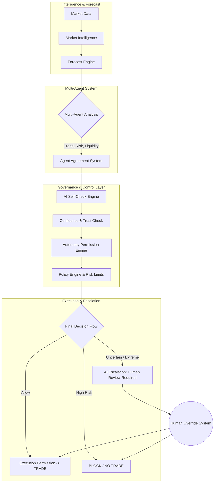

# IATI OS: Institutional Adaptive Trading Intelligence Operating System
## Phase 15: Autonomous AI Trading Agent Governance Engine

Dokumen ini merupakan spesifikasi rasmi untuk Fasa 15 (Autonomous AI Trading Agent Governance Engine) bagi IATI OS. Matlamat utama fasa ini adalah untuk mengawal selia ejen kecerdasan buatan (AI) yang beroperasi secara autonomi, memastikan ia mematuhi sempadan risiko institusi (institutional boundaries), boleh menjelaskan setiap tindakan, meminta bantuan apabila keliru, dan tidak melakukan perubahan melulu.

---

### 1. AI Governance Architecture & Decision Approval Flow

Seni bina Tadbir Urus AI mengawal laluan keputusan, dari penganalisaan ke pelaksanaan, dengan memastikan setiap tindakan mempunyai kelulusan serampang dua mata: Risiko & Tadbir Urus (Governance).

---

### 2. Autonomy Level Framework

Sistem ini mempunyai 6 Tahap Autonomi yang boleh dilaraskan oleh pengurus institusi (Portfolio Manager) berdasarkan *Trust Score* dan kematangan AI.

*   **LEVEL 0 (Manual Mode):** Trader membuat semua keputusan sepenuhnya. AI dilumpuhkan.
*   **LEVEL 1 (AI Assistant):** AI sekadar memberi cadangan, ramalan, dan nasihat. Keputusan di tangan manusia.
*   **LEVEL 2 (AI Approval Mode):** AI menjana idea *trade* beserta saiz lot. Memerlukan butang *Human Approve* untuk dihantar ke broker.
*   **LEVEL 3 (Supervised Automation):** AI boleh melaksanakan *trade* sendiri secara automatik **hanya** dalam had risiko dan keadaan pasaran (Market Regime) yang ditetapkan.
*   **LEVEL 4 (Autonomous Trading):** AI melaksanakan pesanan secara sendiri, mengurus risiko, dan mengawal kerugian secara autonomi selaras dengan rangka kerja tadbir urus (Governance).
*   **LEVEL 5 (Adaptive Autonomous System):** AI bukan sahaja berdagang sendiri, tetapi boleh mengoptimumkan strategi dan memori tanpa pengawasan ketat, tertakluk kepada kawalan *Policy Engine*.

---

### 3. Permission Model & Safety Rules

*   **AI Self-Check Engine:** Sebelum melaksanakan pesanan, AI wajib menyoal dirinya sendiri:
    1.  *Adakah data pasaran lengkap?*
    2.  *Adakah keadaan pasaran (Market Condition) jelas?*
    3.  *Adakah bukti/pengesahan (Evidence) cukup kuat?*
    4.  *Adakah tahap risiko mematuhi standard?*
    5.  *Adakah keputusan ini bercanggah dengan memori sejarah?*
*   **Autonomous Risk Limits:** AI dilarang keras melanggar perlindungan statik yang ditetapkan:
    *   Kerugian Maksimum Harian (Maximum Daily Loss), Kekerapan Trade Maksimum, Had Saiz Posisi, Had Pendedahan Portfolio, dan *Drawdown*.
*   **Confidence Collapse Protection:** Jika prestasi unjuran (Prediction Accuracy) menurun mendadak, sistem mengklasifikasikan situasi ini sebagai "Confidence Collapse" lalu menurunkan tahap autonomi, mengecilkan risiko, atau menangguhkan perdagangan (Pause System).

---

### 4. Multi-Agent Agreement System

Keputusan berprofil tinggi tidak boleh dibuat oleh satu algoritma sahaja. IATI OS menggunakan persetujuan gabungan ejen (*Minimum Agreement Threshold*).

*   **Konsensus Ejen (Consensus):** Ejen Trend, Ejen Struktur, Ejen Risiko, Ejen Kecairan, dan Ejen Peramalan perlu mencari kata sepakat.
    *   *Contoh Syarat:* Sekurang-kurangnya **4 daripada 5 ejen** bersetuju sebelum sesuatu pesanan diluluskan untuk pelaksanaan (Execute).
*   **AI Disagreement Handling:** Jika perbalahan kritikal wujud (Cth: Ejen Trend mengundi *BUY*, Ejen Risiko mengundi *HIGH RISK*, dan Ejen Peramalan mengundi *UNCERTAIN*), sistem mengeluarkan arahan: **WAIT**. AI tidak akan dipaksa memilih.

---

### 5. Human Override Design & AI Escalation

Sistem memberi keseimbangan antara kawalan manusia dan kuasa pengkomputeran.

*   **AI Escalation System (Peningkatan kepada Manusia):** AI dilatih untuk "mengenal pasti ketidaktahuannya" (Identify its own ignorance). Jika wujud keadaan pasaran yang tidak pernah berlaku (Unknown market condition), atau wujud isyarat yang amat bercanggah (Conflicting signals), AI mencetuskan amaran: **"Human review required"**.
*   **Human Override System:** Penganalisis/Pengurus Portfolio boleh campur tangan pada bila-bila masa untuk: `Approve`, `Reject`, `Modify`, atau `Pause`. Semua jenis pengambilalihan kawalan (override) disimpan dalam sistem pengauditan (*Audit Framework*).

---

### 6. Audit Framework & Incident Management System

Keselamatan dan kestabilan AI mesti diaudit untuk memastikan ia tidak bertukar menjadi tidak menentu (Rogue AI).

*   **AI Behaviour Audit:** Sistem memantau kelakuan jangka panjang AI secara berterusan. Persoalan audit: *Adakah AI mula overtrade? Adakah AI mengabaikan risiko? Adakah AI menjadi terlalu agresif apabila mengalami drawdowns?*
*   **Autonomous Incident Management:** Sekiranya AI melakukan kesilapan perdagangan yang berisiko besar atau logik keputusan yang teruk, sistem menyiasat rekod: *Apa yang berlaku? Kenapa berlaku? Apakah impaknya? Apakah pembetulan teknikal (Correction) yang akan diambil?*
*   **AI Decision Explanation Requirement:** Segala tindakan otonomi diwajibkan untuk merekodkan parameter Explainable AI: *Decision, Reason, Evidence, Confidence, Risk, Alternative Scenario.*

---

### 7. Deployment Rules (Version Governance & Testing)

Setiap pertukaran model, penyelarasan AI, atau pengoptimuman kelakuan mesti melepasi saluran ujian pengesahan keselamatan.

*   **Autonomous Mode Testing:** Sebelum kemas kini dipasang di produksi, ujian yang wajib merangkumi: *Simulation*, *Backtest*, *Shadow Mode* (Maya), dan *Paper Trading*.
*   **AI Version Governance:** Setiap peningkatan pada enjin pembuatan keputusan atau model AI (Contoh dari v1.0 ke v1.1) mesti merekodkan parameter khusus dalam repositori kawalan sistem: `Version`, `Change description`, `Reason for change`, dan `Validation Result`.

---

### 8. Implementation Roadmap (Phase 15)

1.  **Tahap 1:** Membina kerangka hierarki hak kawalan (**Autonomy Level Framework**) dari Tahap 0 hingga Tahap 5.
2.  **Tahap 2:** Pembangunan kerangka kelulusan ejen majmuk (**Multi-Agent Agreement System** & **Disagreement Handling**).
3.  **Tahap 3:** Pengaturcaraan mekanik saringan peribadi AI (**AI Self-Check Engine** & **Autonomy Permission Engine**).
4.  **Tahap 4:** Penciptaan sistem perlindungan kemerosotan (**Confidence Collapse Protection**) dan kawalan risiko berautonomi (**Autonomous Risk Limits**).
5.  **Tahap 5:** Penyatuan sistem laporan kelakuan dan pematuhan untuk manusia (**Human Override**, **AI Escalation**, & **Audit Framework**).
6.  **Tahap 6:** Pembinaan paip pengujian, penyebaran, dan pengurusan insiden versi autonomi (Deployment Rules & Incident Management) untuk kelancaran naik taraf sistem.
