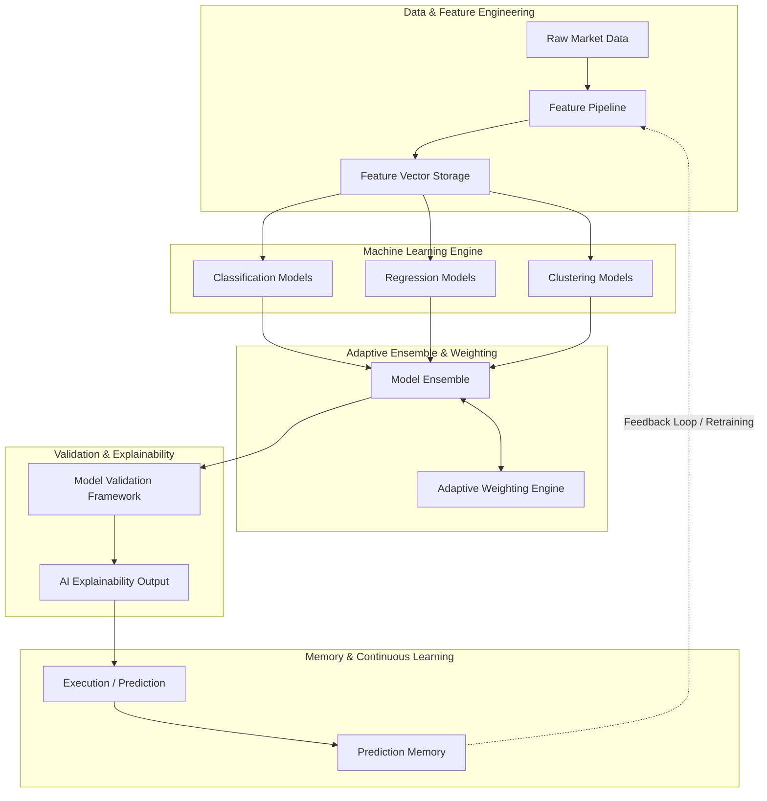

# IATI OS: Institutional Adaptive Trading Intelligence Operating System
## Phase 18: Adaptive AI Quant Brain (Machine Learning Engine)

Dokumen ini merupakan spesifikasi rasmi untuk Fasa 18 (Adaptive AI Quant Brain) bagi IATI OS. Fasa ini menaik taraf sistem daripada tahap kecerdasan berasaskan peraturan (Rule-based intelligence) kepada tahap pembelajaran mesin dan penyesuaian kognitif berterusan (Adaptive AI Quant Brain).

---

### 1. ML Architecture (Model Lifecycle & Workflow)

Seni bina AI Quant Brain mengamalkan kitaran hayat model (Model Lifecycle) secara tertutup di mana sistem mengumpul data, melatih model, menguji, melaksanakan, dan belajar daripada kegagalan.

---

### 2. Feature Pipeline (Feature Engineering)

Data pasaran mentah (harga/volum) tidak mencukupi untuk algoritma ML. Kita mesti menukar keadaan struktur pasaran menjadi data berangka (Feature Vector).

*   **Market Features:**
    *   *Trend:* Kecerunan purata bergerak, pengayun (oscillator) dinormalisasi.
    *   *Momentum:* Kadar perubahan (ROC), perbezaan (divergence).
    *   *Volatility:* ATR yang dinormalisasi, Bollinger Band width.
    *   *Liquidity:* Kekerapan anomali volum, jarak dengan zon kecairan.
    *   *Structure:* Pengecaman pola *Higher High/Lower Low* dalam bentuk binari.
    *   *Session:* Pengekodan One-Hot (One-Hot Encoding) untuk sesi (London, NY, Tokyo).
    *   *News Impact:* Pembolehubah pemula (Dummy variables) berikutan masa kejadian berimpak tinggi.
*   **Penyimpanan:** Disimpan sebagai `Feature Vector` dalam repositori pemprosesan untuk memudahkan latihan semula (Retraining).

---

### 3. Machine Learning Engine

Sistem tidak dibina dengan satu jenis algoritma; ia menggunakan pendekatan serampang tiga mata berdasarkan matlamat analisis.

*   **Classification Model:** Menghasilkan keputusan deskrit.
    *   *Output:* `BUY`, `SELL`, atau `WAIT`.
    *   *Gunaan:* Menentukan arah dagangan dengan pengelas bertingkat (Cth: XGBoost, Random Forest).
*   **Regression Model:** Meramalkan julat titik (point range) atau jangkaan pergerakan.
    *   *Output:* *Expected movement* (Cth: Unjuran pips untuk Take Profit / Stop Loss).
    *   *Gunaan:* Linear Regression atau LSTM untuk siri masa ramalan.
*   **Clustering (Unsupervised Learning):** Mengelaskan fasa pasaran tanpa label terdahulu.
    *   *Output:* *Market regime detection* (Cth: Rejim A, Rejim B).
    *   *Gunaan:* K-Means atau DBSCAN untuk mengelaskan "sideways", "trending", atau "volatile".

---

### 4. Model Ensemble & Adaptive Weighting Engine

Menggabungkan ramalan daripada pelbagai kerangka kognitif untuk menstabilkan dan meningkatkan ketepatan *Combined Probability*.

*   **Model Ensemble:**
    *   `Technical Model` (Indikator asas).
    *   `Statistical Model` (Mean reversion, standard deviation).
    *   `Machine Learning Model` (Corak tak linear).
    *   `LLM Reasoning Model` (Logik kualitatif & makro).
    *   *Output Gabungan:* Nilai kebarangkalian akhir (*Combined Probability*).
*   **Adaptive Weighting Engine:** Mengesan dan belajar keberkesanan setiap model (Signal) mengikut keadaan pasaran (Regime).
    *   *Contoh Pembelajaran AI:* Ketika *Trend Market*, model Trend Following diberikan peratus wajaran 70%. Apabila keadaan berubah menjadi *Range Market* atau *High Volatility*, sistem akan menurunkan wajaran model Trend secara automatik (dynamic adjust) dan menaikkan wajaran model Mean Reversion.

---

### 5. Prediction Memory

Menyediakan ruang untuk gelung maklum balas (feedback loop) dan pembangunan diri (*Self-improvement*).

*   Sistem menyimpan setiap langkah: `Prediction`, `Actual Outcome`, `Accuracy Score`, dan `Lesson Learned`.
*   Jika AI secara sistematik gagal meramal pembalikan (reversal) dalam persekitaran kecairan yang nipis, sistem akan mendaftarkan amaran, mengurangkan markah kebolehpercayaan model yang bersalah, dan meminta latihan semula.

---

### 6. Validation Framework (Model Validation)

Melindungi strategi sistem dari *Overfitting* dan bias pengumpulan sampel. Ujian berikut adalah diwajibkan:

1.  **Walk Forward Testing:** Model tidak diuji pada satu ketulan data secara statik. Sebaliknya, model dilatih dan disahkan pada "tingkap data" yang bergerak seiring masa, mensimulasikan penggunaan persekitaran secara dinamik.
2.  **Out-of-sample Testing:** Pengesahan ke atas data sejarah yang tidak pernah "dilihat" semasa latihan (Hold-out dataset) bagi memastikan ramalan tetap berfungsi.
3.  **Monte Carlo Testing:** Simulasi gangguan data rawak (Random noise/sequence permutation) bagi menguji ketahanan model pada senario terburuk (Risk of Ruin).

---

### 7. AI Explainability (XAI)

Model Kotak Hitam (Black-Box AI) dilarang sama sekali dalam membuat keputusan kewangan. Algoritma (seperti SHAP values atau LIME) digunakan untuk menyahkod pembuatan keputusan ML.

Setiap Ramalan (Prediction) mesti menyertakan:
1.  **Why?:** Menerangkan faktor pemandu utama (Feature Importance).
2.  **Evidence?:** Memetik corak khusus yang sama pada masa lampau.
3.  **Confidence?:** Margin kepastian (% Confidence Interval).
4.  **Risk?:** Faktor ralat (Error tolerance) atau perkara yang akan membatalkan *trade* ini.

---
**Status:** Phase 18 AI Quant Brain - **APPROVED FOR ML ENGINEERING WORKFLOW**
