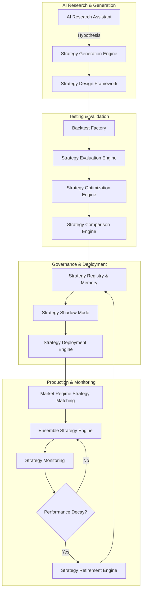
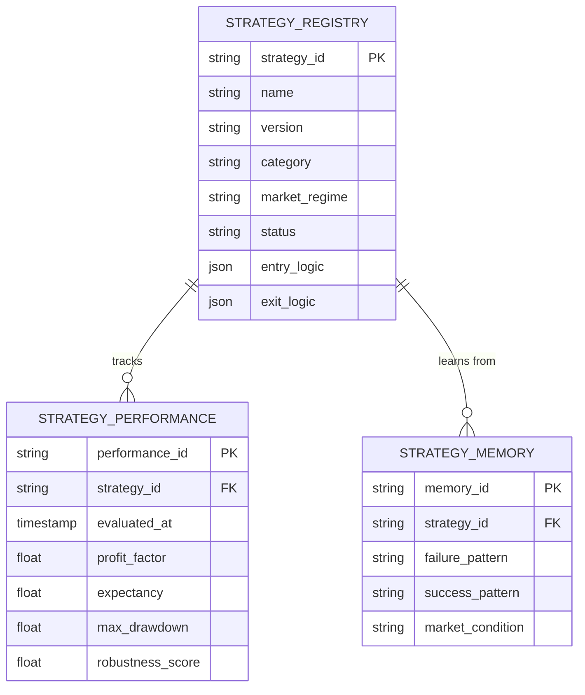

# IATI OS: Institutional Adaptive Trading Intelligence Operating System
## Phase 10: AI Strategy Factory & Intelligence System

Dokumen ini merupakan spesifikasi rasmi untuk Fasa 10 (AI Strategy Factory) bagi IATI OS. Fasa ini bertindak sebagai kilang kecerdasan (intelligence factory) yang bertanggungjawab mencipta, menguji, membandingkan, mengoptimumkan, dan menamatkan strategi dagangan secara sistematik dan berterusan. Sistem ini memastikan IATI OS tidak bergantung pada satu strategi statik, sebaliknya mempunyai ekosistem strategi yang beradaptasi dengan perubahan pasaran.

---

### 1. Strategy Factory Architecture

Seni bina AI Strategy Factory direka untuk mengautomasikan kitaran hayat penemuan strategi dan memastikan hanya strategi yang mempunyai *Edge* statistik yang kukuh dibenarkan beroperasi.

---

### 2. Strategy Lifecycle Diagram

Setiap strategi dalam ekosistem IATI OS mesti melalui kitaran hayat yang ketat tanpa jalan pintas.

1.  **Experimental:** Penjanaan hipotesis dan reka bentuk peraturan awal.
2.  **Testing:** Ujian *Backtest*, *Walk Forward Analysis*, dan *Monte Carlo*.
3.  **Shadow:** Strategi berjalan secara maya (Live data, tiada execution) untuk pengesahan *out-of-sample*.
4.  **Active (Production):** Strategi digabungkan ke dalam *Ensemble Engine* untuk berdagang secara nyata.
5.  **Paused:** Prestasi menurun ke paras amaran, memerlukan kalibrasi semula.
6.  **Retired:** Strategi kehilangan *Edge* sepenuhnya akibat perubahan tingkah laku pasaran.

---

### 3. Strategy Database Schema (Registry & Memory)

Pangkalan data untuk menyimpan profil, sejarah, dan status setiap strategi dalam ekosistem.

---

### 4. AI Research Workflow & Strategy Generation

AI Research Assistant bertindak sebagai pembantu penganalisis kuantitatif.

*   **Observation:** AI menganalisis data pasaran lampau dan mencari anomali atau corak berulang. (Cth: *Liquidity sweep selepas London Open kerap menghasilkan pembalikan arah*).
*   **Hypothesis Generation:** AI mencadangkan hipotesis.
*   **Design Framework:** AI menstrukturkan cadangan ke dalam format logik yang boleh dieksekusi: `Market Condition`, `Entry Criteria`, `Confirmation`, `Invalidation`, `Stop Loss`, `Take Profit`, `Position Size`.
*   *Nota:* AI tidak dibenarkan terus melakukan pertukaran (deploy). Ia hanya mengemukakan `Strategy Proposal` untuk diuji.

---

### 5. Backtesting Framework & Optimization

*   **Backtest Factory:** Menguji strategi merentasi rejim pasaran yang berbeza (Trending, Ranging, Volatile), sesi berbeza, dan instrumen pelbagai. Ia mesti memasukkan *slippage* dan *spread* sebenar.
*   **Strategy Optimization Engine:** Pengoptimuman (Optimization) dikawal ketat untuk mengelakkan *Curve Fitting*.
    *   Sistem menggunakan *Walk Forward Analysis* (WFA).
    *   Jika strategi baru lebih kompleks tetapi peningkatan prestasi adalah marginal (< 5%), sistem akan menolak strategi tersebut (Occam's Razor Principle).

---

### 6. Evaluation Metrics & Strategy Score Engine

Setiap strategi akan dinilai dan diberi markah (Score) untuk proses pemeringkatan (Ranking). Fokus adalah pada kualiti, bukan hanya keuntungan.

*   **Profitability:** Profit Factor (>1.5), Expectancy, Average RR.
*   **Risk:** Maximum Drawdown, Recovery Factor, Risk of Ruin.
*   **Consistency:** Kestabilan bulanan merentasi rejim pasaran.
*   **Robustness:** Prestasi data luar sampel (Out-of-sample).

*Skor Keseluruhan:* `(Profit * 30%) + (Risk * 25%) + (Consistency * 20%) + (Robustness * 15%) + (Adaptability * 10%)`.

---

### 7. Deployment Process (Market Regime Matching & Ensemble)

Sebaik sahaja strategi diluluskan, ia masuk ke dalam *Market Regime Strategy Matching*.

*   **Regime Matching:** Sistem tidak menggunakan satu strategi sepanjang masa. Jika pasaran berada dalam "Strong Trend", sistem akan mengaktifkan *Trend Following Strategy*. Jika pasaran "Range", ia beralih ke *Mean Reversion*.
*   **Ensemble Strategy Engine:** Keputusan tidak dibuat oleh satu strategi. Sistem menggabungkan (Blend) isyarat daripada Strategi A, B, dan C berdasarkan wajaran (Weighting) kelajuan dan rekod prestasi masa lalu mereka.

---

### 8. Strategy Monitoring & Retirement Rules

Pengawasan aktif adalah wajib untuk memastikan modal dilindungi daripada strategi yang "rosak".

*   **Strategy Monitoring:** Memantau pereputan prestasi (Performance Decay), kejatuhan mendadak *Win Rate*, atau peningkatan *Drawdown*.
*   **Strategy Retirement Engine:** Sistem memberhentikan (Retire) strategi secara automatik jika:
    1.  *Edge* statistik strategi hilang sepenuhnya.
    2.  Tahap kemerosotan (Drawdown) melebihi had ujian tekanan (Stress Test) asal.
    3.  Tingkah laku struktur pasaran (Market Behaviour) berubah secara kekal.

---

### 9. Strategy Governance & Versioning

Semua perubahan dan iterasi pada sesuatu strategi dikawal oleh *Governance Engine*.

*   Setiap pengubahsuaian mencipta versi baharu (Cth: v1.0 ke v1.1).
*   Sistem merekodkan: *Version, Reason for change, Evidence (Hasil Backtest), Approval (Oleh Risk Manager), Performance Impact.*
*   Mengekalkan jejak audit yang telus untuk siasatan masa depan.

---

### 10. Implementation Roadmap (Phase 10)

1.  **Tahap 1:** Reka bentuk Skema Pangkalan Data *Strategy Registry* dan API pengurusan versi.
2.  **Tahap 2:** Pembangunan *Backtest Factory* (Bersepadu dengan Data Sejarah dari Fasa 1).
3.  **Tahap 3:** Pembinaan *Strategy Evaluation Engine* & *Scorecard Metrics*.
4.  **Tahap 4:** Membangunkan integrasi *AI Research Assistant* untuk penjanaan hipotesis strategi.
5.  **Tahap 5:** Pembangunan *Strategy Shadow Mode* dan proses pengumpulan prestasi luar sampel.
6.  **Tahap 6:** Pembinaan logik *Ensemble Engine* dan *Strategy Retirement* (Circuit Breaker strategi).
