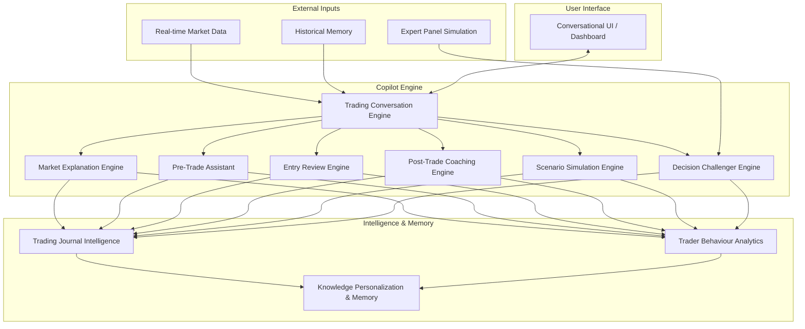
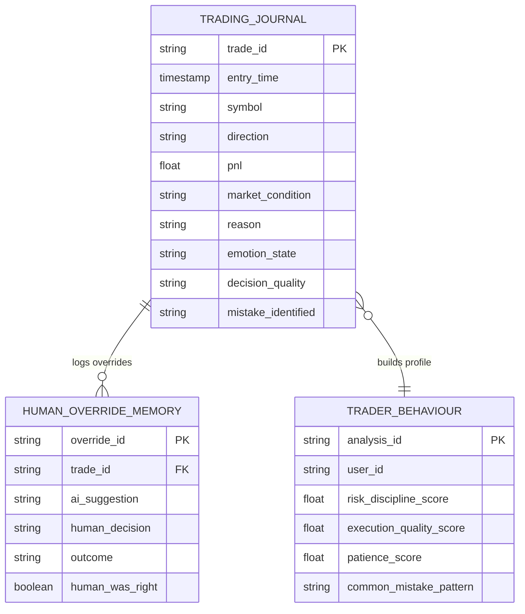

# IATI OS: Institutional Adaptive Trading Intelligence Operating System
## Phase 12: Human + AI Trader Copilot Engine Specification

Dokumen ini merupakan spesifikasi rasmi untuk Fasa 12 (Human + AI Trader Copilot Engine) bagi IATI OS. Fasa ini direka untuk membina rakan risikan perdagangan (Trading Intelligence Partner) yang interaktif. Ia bukan sekadar "pembekal isyarat" (signal provider), tetapi bertindak sebagai mentor, pengurus risiko, dan penganalisis tingkah laku yang membimbing pedagang (trader) membuat keputusan berasaskan bukti, disiplin, dan pengurusan risiko yang tepat.

---

### 1. AI Copilot Architecture

Seni bina enjin Copilot menggabungkan antara muka perbualan (Conversational Interface) dengan enjin analitik dan enjin memori berstruktur untuk memberi sokongan keputusan menyeluruh.

---

### 2. Conversation Design & Decision Review Framework

AI Copilot berinteraksi melalui dialog dua hala yang didorong oleh konteks (context-driven). Ia tidak memberikan isyarat membuta-tuli, sebaliknya menerangkan "Kenapa", "Risiko", dan "Alternatif".

*   **Market Explanation:** Menjelaskan rejim, struktur, kecairan, momentum, dan risiko pasaran apabila ditanya (*Cth: "Bagaimana keadaan EURUSD sekarang?"*).
*   **Pre-Trade Assistant:** Melaksanakan senarai semak (checklist) prapelaksanaan.
    *   *Adakah trend jelas? Adakah pengesahan cukup? Adakah risiko boleh diterima?* ➜ Menjana **Trade Quality Score**.
*   **Entry Review Engine:** Menilai idea *trade* pengguna.
    *   Jika pengguna berkata "BUY EURUSD", Copilot akan membalas dengan status: **APPROVED**, **CAUTION**, atau **REJECT**, berserta ulasan bukti dan risiko.
*   **Decision Challenger Engine:** AI bertindak sebagai "Syaitan Peguam Bela" (Devil's Advocate). Jika pengguna terburu-buru, AI akan mencabar rasionaliti *trade* berdasarkan ketiadaan pengesahan (confirmation).

---

### 3. Trading Journal Intelligence (Database Schema)

Jurnal perdagangan bukan hanya mencatat kewangan, tetapi merakam keadaan psikologi, rasional, dan keadaan pasaran semasa *trade* dibuat.

---

### 4. Behaviour Analytics & Personal Performance Score

Modul ini memantau dan menganalisis kebiasaan (habit) pedagang secara kuantitatif.

*   **Trader Behaviour Analytics:** Mengesan corak negatif seperti:
    1. Masuk posisi terlalu awal (FOMO).
    2. *Overtrade* selepas kerugian (Revenge trading).
    3. Mengambil untung terlalu cepat (Fear).
    4. Mengabaikan profil risiko (Over-leveraging).
*   **Personal Performance Score:** Metrik yang mengukur disiplin pedagang, terdiri daripada:
    *   *Analysis Quality (70/100)*
    *   *Risk Discipline (92/100)*
    *   *Execution Quality (80/100)*
    *   *Patience & Consistency (65/100)*

---

### 5. Personalization Engine & Knowledge Memory

Copilot mesti menyesuaikan nasihat dan respons mengikut gaya unik (Trading Style) pengguna.

*   **Knowledge Personalization:** Mengkategorikan pengguna (Scalper, Day Trader, Swing Trader, Position Trader) dan melaraskan tempoh masa analisis (timeframe) serta tahap toleransi risiko mengikut kesesuaian.
*   **Learning Recommendation Engine:** Menyediakan modul pembelajaran tersuai berdasarkan kelemahan yang dikesan. (*Cth: "Anda kerap kerugian ketika Breakout. Mari kaji corak False Breakout."*)

---

### 6. Expert Panel Simulation & Explainable AI (XAI)

Untuk sokongan keputusan yang komprehensif, Copilot mensimulasikan sekumpulan "Pakar Maya" (Virtual Experts).

*   **Technical Analyst:** Menilai carta, struktur, dan corak harga.
*   **Risk Manager:** Menilai saiz posisi (position sizing) dan pendedahan portfolio.
*   **Quant Analyst:** Menyemak nilai jangkaan statistik (Expected Value) dan sejarah strategi.
*   **Market Psychologist:** Menasihati tentang pengurusan emosi dan disiplin.
*   **Explainable AI Requirement:** Setiap semakan idea mesti memaparkan "Reason, Evidence, Confidence, Risk, and Alternative Scenario".

---

### 7. Trading Plan Generator & Mentor Reports

Copilot akan menjana pelan tindakan harian dan laporan pasca-perdagangan secara berkala.

*   **Trading Plan Generator:** Membantu membina Pelan Harian (Daily Plan), Bias Pasaran, Tahap Utama (Key Levels), dan Had Risiko.
*   **Post-Trade Coaching Engine:** Membuat ulasan (Review) selepas *trade* ditutup: "Apa yang betul?", "Apa yang salah?", dan "Apa pengajarannya?".
*   **AI Trading Mentor Report:** Laporan harian dan mingguan yang memperincikan tingkah laku perdagangan, kesilapan biasa (Mistakes), dan perkembangan kemahiran (Skill Development).

---

### 8. Dashboard Design (Copilot UI)

Antara muka (UI) untuk Copilot terdiri daripada widget yang mengintegrasikan perbualan dan data visual.

1.  **Copilot Chat Interface:** Ruang perbualan utama untuk semakan idea (Pre-Trade Assistant) dan analisis senario (Scenario Simulation Engine).
2.  **Trader Scorecard:** Radar chart atau *progress bar* yang memaparkan skor disiplin, kualiti pelaksanaan, dan kesabaran.
3.  **Market Briefing Panel:** Penjelasan ringkas AI mengenai keadaan pasaran, rejim semasa, dan ringkasan korelasi.
4.  **Journal & Insights:** Paparan entri jurnal terkini yang telah diperkayakan dengan ulasan AI dan analisis kesilapan (Mistake Detection).

---

### 9. API Specification (Copilot Services)

REST API endpoints untuk integrasi antara muka sembang dan enjin analitik.

*   **`POST /api/v1/copilot/chat`**
    *   *Fungsi:* Menghantar mesej pengguna kepada Trading Conversation Engine dan mengembalikan respons AI berdasarkan konteks pasaran.
*   **`POST /api/v1/copilot/review-entry`**
    *   *Fungsi:* Menghantar draf *trade* (Symbol, Direction, Risk) untuk dinilai oleh *Pre-Trade Assistant* & *Expert Panel*.
*   **`GET /api/v1/copilot/trader-score`**
    *   *Fungsi:* Mengambil metrik kelakuan pedagang (Behaviour Analytics) dan skor prestasi peribadi.
*   **`POST /api/v1/copilot/journal/entry`**
    *   *Fungsi:* Menyimpan entri jurnal (termasuk emosi dan sebab) untuk dianalisis oleh *Post-Trade Coaching Engine*.
*   **`GET /api/v1/copilot/report/weekly`**
    *   *Fungsi:* Menjana Laporan Mentor Mingguan (Weekly Mentor Report) yang merumuskan prestasi, kesilapan, dan cadangan pembelajaran.

---

### 10. Implementation Roadmap (Phase 12)

1.  **Tahap 1:** Mereka bentuk Skema Pangkalan Data untuk **Trading Journal Intelligence** dan **Trader Behaviour Analytics**.
2.  **Tahap 2:** Pembangunan **Trading Conversation Engine** dengan integrasi LLM (Cth: OpenAI/Gemini) yang dipacu (prompt-engineered) khas untuk perdagangan.
3.  **Tahap 3:** Pembinaan **Pre-Trade Assistant** dan **Entry Review Engine** untuk fungsi semakan senarai (checklist) dan penilaian idea *trade*.
4.  **Tahap 4:** Pembangunan **Decision Challenger Engine** dan **Expert Panel Simulation** (berbilang *agent personas*).
5.  **Tahap 5:** Pembinaan **Mistake Detection Engine** dan logik pemarkahan prestasi peribadi (Personal Performance Score).
6.  **Tahap 6:** Integrasi antaramuka perbualan ke Papan Pemuka (Dashboard Design) dan penjanaan **AI Trading Mentor Report** harian/mingguan.
