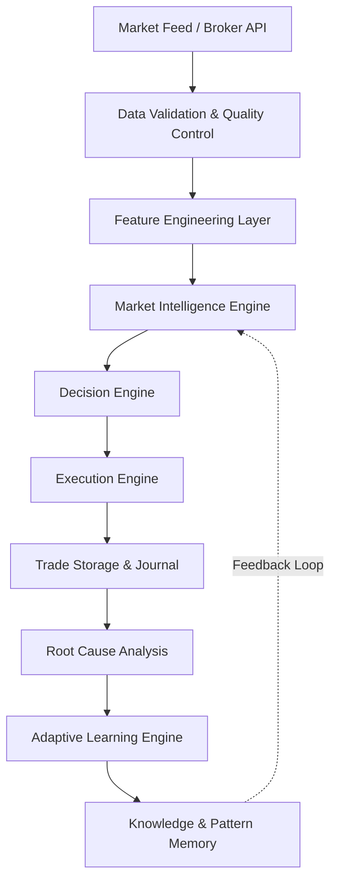
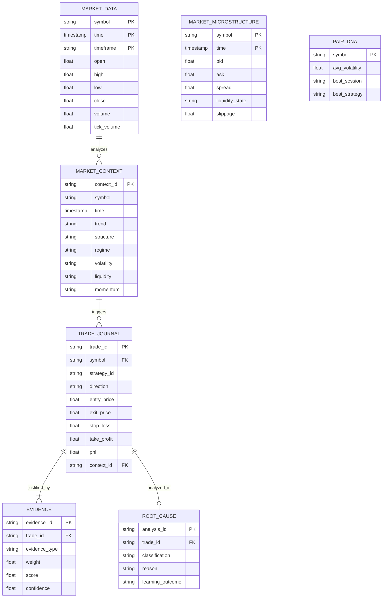

# IATI OS: Institutional Adaptive Trading Intelligence Operating System
## Phase 1: Data Foundation & Architecture Specification

Dokumen ini merupakan spesifikasi rasmi untuk Fasa 1 (Data Foundation) bagi IATI OS. Ia direka untuk menyokong analisis masa nyata, pembelajaran mesin (ML), pengenalan corak, pengoptimuman strategi, dan pengurusan risiko berskala institusi.

---

### 1. Complete Data Architecture & Pipeline

Seni bina data dibahagikan kepada beberapa lapisan utama untuk memastikan integriti dan kepantasan.

---

### 2. Database Schema & Entity Relationship Diagram (ERD)

Sistem menggunakan gabungan Time-Series Database (TSDB) untuk data pasaran dan Relational Database (RDBMS) untuk memori dan jurnal.

---

### 3. AI Memory Architecture

Sistem AI IATI OS menggunakan memori berperingkat untuk pemprosesan pantas dan pembelajaran jangka panjang.

*   **Short-Term Memory (Current Market State):**
    *   *Teknologi:* Redis / In-Memory Cache.
    *   *Kandungan:* Tick data terkini, Order Book, Volatility semasa, Spread masa nyata, Technical Snapshot (EMA, RSI pada masa itu).
*   **Medium-Term Memory (Recent Performance):**
    *   *Teknologi:* Relational Database (PostgreSQL).
    *   *Kandungan:* Trade Journal, Evidence Scores, Root Cause Analysis untuk 100-500 trade terakhir. Digunakan untuk menyesuaikan saiz lot (Dynamic Risk Budgeting).
*   **Long-Term Memory (Knowledge Base):**
    *   *Teknologi:* Data Warehouse / Vector Database.
    *   *Kandungan:* Pattern Memory (Win rate sejarah bagi corak tertentu), Pair DNA, dan Strategy Profiles.

---

### 4. Market Intelligence & Technical Snapshot

Setiap kali keputusan dinilai, sistem tidak sekadar melihat harga, tetapi merakam keadaan pasaran secara keseluruhan:

*   **Market Context Object:** `{ regime: "trending", structure: "higher_high", session: "London" }`
*   **Technical Snapshot:** Nilai tepat (exact value) pada masa pengiraan (CTH: `EMA50: 1.0950`, `RSI: 65 (Bullish Zone)`, `ADX: 28`).

---

### 5. Trade Journal & Root Cause Intelligence

Jurnal IATI OS bukan sekadar merekod PnL. Ia direka untuk Explainable AI (XAI).

*   **Trade Record:** Mengandungi Key Performance Indicators (MAE, MFE, RR, Holding Time).
*   **Root Cause Diagnosis:**
    *   Jika Menang: *Kenapa?* (Trend continuation, Strong Momentum).
    *   Jika Kalah: *Klasifikasi:* (Wrong Bias, Fake Breakout, Liquidity Sweep, News Impact).
*   **Adaptive Learning:** Diagnosis ini dipindahkan ke Long-Term Memory untuk mengemas kini profil *Strategy* dan *Pair DNA*.

---

### 6. ML Feature Store & Machine Learning Readiness

Data disediakan untuk model klasifikasi dan ramalan, mengelakkan kecacatan (Data Leakage & Look Ahead Bias).

*   **Feature Engineering:** Normalisasi harga, penciptaan ciri berkala (Time-of-day features), Rolling Z-Scores untuk volatiliti.
*   **Target Variables:** Next N-period return, Max Adverse Excursion (MAE) risk, Breakout Probability.
*   **Validation Framework:** Menggunakan pengujian Walk-Forward (Walk-Forward Testing) dengan OOS (Out-of-Sample) data. Tiada pengoptimuman parameter berdasarkan sampel kecil (< 100 trade).

---

### 7. Data Quality Control Framework

Pemeriksaan automatik sebelum data memasuki Market Intelligence Engine:
*   **Missing Candle Detector:** Interpolasi jika terlepas < 3 tick, BLOCK TRADING jika > 1 minit.
*   **Spread Anomaly:** BLOCK TRADING jika spread melebihi `3x purata (30-period)`.
*   **Latency Check:** Membatalkan execution jika masa ping broker > 200ms.

---

### 8. Implementation Roadmap (Phase 1 to Phase 2)

1.  **Tahap 1:** Penyediaan Database Schema & TSDB (PostgreSQL + TimescaleDB).
2.  **Tahap 2:** Pembangunan Data Quality Control & API Broker Feed.
3.  **Tahap 3:** Pembinaan Feature Engineering Layer & Market Context snapshot.
4.  **Tahap 4:** Struktur Trade Journal & Root Cause Storage.
5.  **Tahap 5 (Persediaan Phase 2):** Integrasi Decision Engine dengan Memory Storage untuk Explainable AI.
