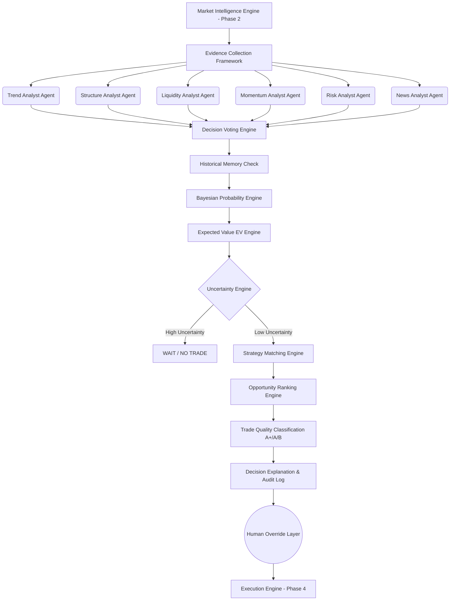

# IATI OS: Institutional Adaptive Trading Intelligence Operating System
## Phase 3: Decision Intelligence Engine & Architecture Specification

Dokumen ini merupakan spesifikasi rasmi untuk Fasa 3 (Decision Intelligence Engine) bagi IATI OS. Enjin ini bertindak sebagai "otak" kuantitatif yang mensintesis data pasaran (Fasa 1) dan kecerdasan pasaran (Fasa 2) ke dalam bentuk kebarangkalian Bayesian, Nilai Jangkaan (Expected Value - EV), dan pengelasan kualiti dagangan sebelum membenarkan sebarang pelaksanaan (Execution). 

Ia tidak direka untuk mencari isyarat *hardcoded* "IF X THEN BUY", sebaliknya berfungsi secara kebarangkalian (probabilistic) dan logik.

---

### 1. Decision Engine Architecture & Data Flow

Seni bina Decision Engine berasaskan gabungan *Multi-Agent System* dan *Bayesian Inference Model*.



---

### 2. Evidence Collection Framework

Setiap metrik pasaran ditukar menjadi "Nilai Bukti" (Evidence Score) dengan jumlah maksimum 100 mata. Enjin ini tidak bergantung kepada satu bukti semata-mata.

| Kategori Bukti | Skor Maks | Keterangan & Kriteria Institusi |
| :--- | :---: | :--- |
| **1. Market Structure** | 20 | Pemecahan Struktur (BoS), Perubahan Watak (ChoCh), HH/HL yang selari. |
| **2. Trend Alignment** | 20 | Keselarasan antara Timeframe Daily, H4, dan H1. |
| **3. Liquidity** | 15 | Manipulasi pasaran dikesan (Stop Hunt / Liquidity Sweep). |
| **4. Momentum** | 15 | Volum dan momentum (MACD/RSI/ADX) selari dengan struktur. |
| **5. Volatility** | 10 | Penguncupan bertukar kepada pengembangan (Expansion). |
| **6. Historical Pattern** | 10 | Kebarangkalian berulang berdasarkan *Historical Pattern Match*. |
| **7. Session Quality** | 5 | Kualiti masa berdagang (e.g., London/NY overlap). |
| **8. News Risk** | 5 | Jarak masa dengan acara impak tinggi (High Impact News). |
| **Jumlah Maksimum** | **100** | *Wajaran diubah suai secara dinamik berdasarkan Market Regime.* |

---

### 3. Multi-Agent Analyst Design

Setiap bukti diserahkan kepada agen khusus (Agent) yang akan menghasilkan pendirian (Direction), keyakinan (Confidence), dan alasan (Reason).

*   **Trend Analyst:** Menganalisis keselarasan trend jangka panjang dan sederhana. (Output: `BUY (90%)`)
*   **Structure Analyst:** Fokus kepada pergerakan harga mikro/makro dan *Order Blocks*. (Output: `BUY (85%)`)
*   **Liquidity Analyst:** Menjejak *Smart Money* dan zon kecairan. (Output: `BUY (82%)`)
*   **Momentum Analyst:** Mengukur kekuatan impuls semasa. (Output: `NEUTRAL (50%)`)
*   **Risk Analyst:** Menilai penampan SL dan jarak kepada tahap sokongan/rintangan harian. (Output: `WAIT (40%)`)
*   **News Analyst:** Memastikan tiada risiko *Black Swan* atau volatiliti data makro. (Output: `CLEAR (100%)`)

*Keputusan ejen dikumpulkan oleh Decision Voting Engine untuk menghasilkan pendirian majoriti dengan tahap konflik (conflict rate).*

---

### 4. Bayesian Probability Model Design

Model Bayesian digunakan untuk mengemas kini kebarangkalian sesuatu trade itu akan berjaya, bermula daripada andaian asas (Base Rate) 50%.

*   **P(H) [Prior Probability]:** 50% (Peluang asas menang/kalah).
*   **P(E|H) [Likelihood]:** Kebarangkalian wujudnya bukti (cth. Liquidity Sweep) sekiranya trade itu adalah trade yang berjaya.

**Simulasi Kemas Kini Bayesian (Bayesian Updating):**
1. *Initial Probability:* 50.0%
2. *+ Strong Trend Alignment:* +15.0% (Posterior 1 = 65.0%)
3. *+ Liquidity Sweep Confirmed:* +12.0% (Posterior 2 = 77.0%)
4. *+ High Volume Momentum:* +8.0% (Posterior 3 = 85.0%)
5. *- Spread/Risk Penalty:* -4.0% (Final Probability = 81.0%)

---

### 5. Expected Value (EV) Engine Formula

Setiap set up yang mempunyai kebarangkalian > 60% wajib melepasi ujian Nilai Jangkaan (EV).

**Formula EV:**
`EV = (Probability of Win × Potential Reward) - (Probability of Loss × Potential Risk)`

**Contoh:**
*   Probability Win: 70% (0.7)
*   Probability Loss: 30% (0.3)
*   Reward: $300 (3R)
*   Risk: $100 (1R)
*   `EV = (0.7 * 300) - (0.3 * 100) = 210 - 30 = +$180` (Positive Expectancy) -> **APPROVE**

*Syarat Ketat: Jika EV negatif atau < +$10, keputusan muktamad adalah **NO TRADE**.*

---

### 6. Strategy Matching & Opportunity Ranking

Jika EV adalah positif, sistem menentukan strategi mana yang paling layak (Fit) dengan sentimen semasa:
*   *Regime: Trending* ➜ Matching: **Trend Following System (Score 92%)**
*   *Regime: Sideways* ➜ Matching: **Mean Reversion System (Score 81%)**

**Opportunity Ranking Engine (Portfolio Optimization):**
Jika sistem mengesan 4 peluang serentak, ia tidak akan berdagang semua. Ia meletakkan keutamaan berdasar (Probability × EV).
1. `EURUSD (Score: 92)` ➜ **EXECUTE**
2. `GBPUSD (Score: 87)` ➜ **DISCARD** (Correlation Conflict with EURUSD)
3. `XAUUSD (Score: 81)` ➜ **EXECUTE** (Non-correlated)

---

### 7. Trade Quality & Decision Classification

Trade diklasifikasikan ke dalam Gred Institusi. Hanya Gred A+ dan A dibenarkan untuk *Auto-Execution*.

*   **Gred A+ (Perfect Setup):** Probability > 85%, EV Tinggi, Risiko Rendah, Konflik Agen < 5%.
*   **Gred A (High Probability):** Probability 75%-84%, EV Positif, Risiko Rendah.
*   **Gred B (Wait Confirmation):** Probability 65%-74%, Menunggu penutupan lilin (Candle Close) atau *Retest*. (Keputusan: `WAIT RETEST`)
*   **Gred C (Low Quality):** Probability < 65% atau EV Negatif. (Keputusan: `NO TRADE`)
*   **REJECT:** Risiko pasaran ekstrim, Berita Makro dalam masa < 30 minit. (Keputusan: `WAIT NEWS`)

---

### 8. Explainable AI (XAI) & Audit Log Schema

Bagi memastikan pematuhan dan audit yang telus, setiap keputusan direkod ke dalam pangkalan data berstruktur (Decision Audit Log).

```json
{
  "decision_id": "DEC-20260806-001",
  "timestamp": "2026-08-06T14:30:00Z",
  "symbol": "EURUSD",
  "action": "BUY",
  "grade": "A+",
  "confidence": "91%",
  "expected_value": "+$180",
  "xai_explanation": {
    "why_buy": "Daily trend is bullish, H4 created HH, and Liquidity sweep completed at 1.0920.",
    "why_now": "London session volume expansion detected with ADX at 32.",
    "risk_factors": "Minor resistance at 1.0980 (Low Risk).",
    "invalidation_point": "Break below recent H1 demand block (1.0900)."
  },
  "agent_conflict_rate": "2.5%",
  "human_override": null
}
```

---

### 9. Edge Cases & Human Override Layer

*   **Uncertainty Engine Trigger (Conflicting Evidence):** Trend Agent (BUY) vs Liquidity Agent (SELL). Perbezaan pendapat ejen melebihi 30%. Sistem mematikan trade dan mengeluarkan keputusan `WAIT`.
*   **Human Override:** Pengurus Portfolio (Manusia) boleh memantau Log Keputusan dan menekan `Reject` atau `Modify` (cth. mengubah Take Profit). Sistem akan merekodkan kelayakan pengguna, alasan override, dan masa ia berlaku ke dalam Audit Log.

---

### 10. Testing Framework

Untuk mengelakkan *Overfitting* semasa mengkalibrasi model Bayesian, kerangka ujian (Testing Framework) berikut adalah mandatori:

1.  **Out-of-Sample Walk Forward Testing:** Melatih kebarangkalian Bayesian (Prior & Likelihood) pada 2020-2023, dan menguji keputusannya pada 2024-2025 secara membuta tuli (Blind test).
2.  **Monte Carlo Simulation:** Memutarbelitkan urutan (sequence) trade Gred A+ sebanyak 10,000 kali untuk memastikan risiko Drawdown maksimum berada di bawah 10%.
3.  **Stress Test:** Menguji Decision Engine pada sejarah *Black Swan* (cth. COVID-19 Crash 2020, Brexit 2016) untuk memastikan Uncertainty Engine dan Risk Analyst berjaya mengeluarkan arahan `NO TRADE` dengan pantas.

---

### 11. Implementation Roadmap (Phase 3 to Phase 4)

1.  **Tahap 1:** Membangunkan Evidence Collection Framework & Skema Skor.
2.  **Tahap 2:** Membina Logik Multi-Agent (Struktur, Kecairan, Volatiliti).
3.  **Tahap 3:** Pengaturcaraan Model Bayesian & Kalkulator Expected Value (EV).
4.  **Tahap 4:** Membina Sistem Peringkat (Ranking) Portfolio & Klasifikasi Gred A-C.
5.  **Tahap 5:** Pembangunan Explainable AI (XAI) text generator & log pengauditan (Audit Log).
6.  **Tahap 6 (Persediaan Phase 4):** Menghubungkan keputusan Gred A+ kepada *Risk Intelligence* dan *Execution Engine* (Fasa 4) untuk pelaksanaan pesanan sebenar.
