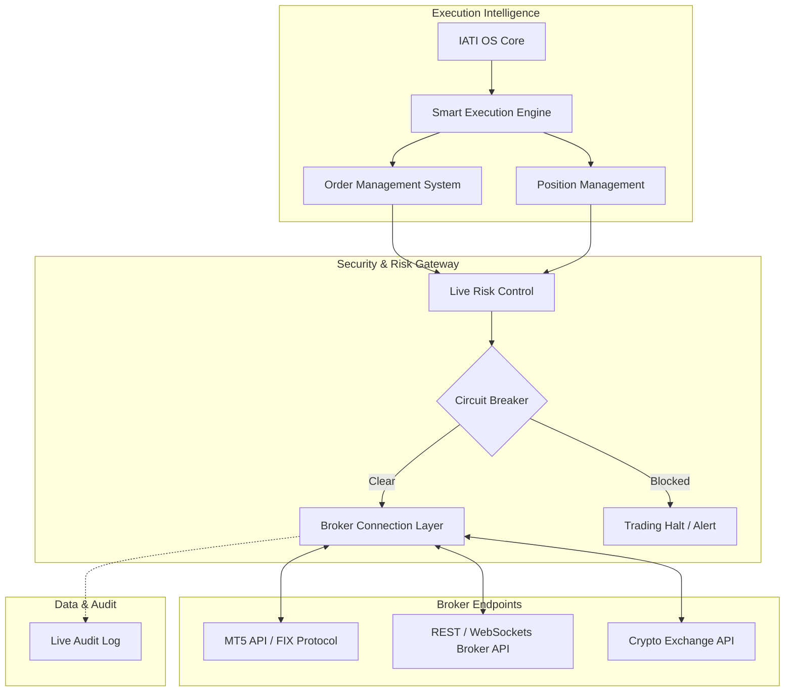

# IATI OS: Institutional Adaptive Trading Intelligence Operating System
## Phase 19: Institutional Execution Engine & Broker Integration

Dokumen ini merupakan spesifikasi rasmi untuk Fasa 19 (Institutional Execution Engine) bagi IATI OS. Fasa ini merapatkan jurang antara keputusan kecerdasan buatan (AI) dengan persekitaran pasaran sebenar (Real Trading Environment). 

**PENTING:** Pelaksanaan dagangan langsung (Live execution) hanya dibenarkan selepas: `MVP Validated + AI Model Validated + Paper Trading Successful`.

---

### 1. Broker Architecture & Connection Layer

Lapisan penyambungan broker (Broker Connection Layer) direka untuk menyokong pelbagai protokol antaramuka bagi memastikan kestabilan dan kepantasan pemindahan data.

**Fungsi Lapisan Penyambungan:**
*   **Market Data:** Mengambil sebut harga (*bid/ask*) pasaran terkini secara terus dari pelayan broker.
*   **Account Info:** Memantau baki (*balance*), ekuiti, dan margin yang tersedia.
*   **Order Request:** Menghantar, mengubah, dan membatalkan pesanan.

---

### 2. Execution Workflow & Order Management

Sistem Pengurusan Pesanan (Order Management System - OMS) mengendalikan kitaran hayat setiap pesanan.

*   **Jenis Pesanan yang Diurus:** *Market Order, Limit Order, Stop Order.*
*   **Protokol Kawalan:** Pelaksanaan Pengubahsuaian (Modification) untuk *Stop Loss* dan *Take Profit*, serta Pembatalan (Cancellation) automatik bagi pesanan tertunda (pending orders) yang telah luput masa (invalidated).

**Aliran Pelaksanaan (Execution Workflow):**
1.  Enjin Keputusan menjana *Trade Object*.
2.  OMS menyemak syarat harga sasaran.
3.  Pesanan dihantar melalui *Broker Connection Layer*.
4.  Sebaik sahaja pesanan dipenuhi (filled), tanggungjawab beralih kepada *Position Management*.

---

### 3. Smart Execution Engine & Position Management

Memastikan setiap *entry* dan pengurusan *trade* dioptimumkan untuk meminimumkan kos (Slippage & Spread) serta memaksimumkan keuntungan.

*   **Smart Execution Engine:**
    *   *Entry Timing:* Menunggu saat optimum untuk pelaksanaan pasaran.
    *   *Slippage & Spread:* Menyemak spread masa nyata. Jika spread melebar lebih dari had maksimum, enjin akan menjeda (*pause*) kemasukan pesanan.
    *   *Liquidity:* Memecahkan pesanan yang sangat besar (*Iceberg orders*) untuk mengelakkan kesan pasaran (market impact) yang ketara.
*   **Position Management:** Mengendalikan posisi yang sedang berjalan (Open position). AI akan menentukan jika *Partial Close* diperlukan, mengubah *Stop Loss* ke titik pulang modal (Break-even), dan menyelaraskan penjejakan harga (Trailing Stop / TP).

---

### 4. Risk Protection: Live Risk Control & Circuit Breaker

Lapisan penapis kritikal yang beroperasi secara *Real-time* sewaktu pasaran berjalan.

*   **Live Risk Control:** Memantau *Exposure* keseluruhan, potensi *Loss*, *Drawdown* semasa (Floating Drawdown), dan *Free Margin*.
*   **Circuit Breaker (Brek Kecemasan):** Modul ini akan memutuskan sambungan dan menghentikan semua operasi dagangan secara automatik apabila mengesan:
    1.  *Extreme Volatility:* Pergerakan harga luar biasa atau *Flash Crash*.
    2.  *System Error:* Kependaman pelayan tinggi (High Ping / Disconnect).
    3.  *Unexpected Loss:* Penurunan ekuiti harian melangkaui had tadbir urus (Cth: -3% sehari).
    4.  *Data Problem:* Suapan data (Data Feed) tersekat atau lilin (candle) hilang.

---

### 5. Live Audit Log

Penyimpanan rekod lengkap dan kalis usik (tamper-proof) untuk semua peristiwa pelaksanaan.

*   Sistem merekodkan: *Setiap Keputusan (Every Decision), Setiap Pesanan (Order sent), Setiap Pengubahsuaian (Modification sent), dan Setiap Kegagalan (Errors/Rejections).*
*   Diperlukan untuk penyelesaian masalah (Troubleshooting), pematuhan pengauditan, dan analisis *Post-Trade*.

---

### 6. Deployment Checklist (Paper to Live Transition)

Proses penyerahan AI kepada modal dunia sebenar mestilah berperingkat dan selamat.

1.  [ ] **Paper Trading:** Ujian pada persekitaran demo/simulasi dengan data sejarah dan data tertunda untuk menguji logik OMS.
2.  [ ] **Shadow Live Mode:** AI disambungkan ke *Live Data* sebenar. Ia membuat keputusan, menjana isyarat, meramalkan *Slippage*, tetapi pesanan disekat (*No actual firing*). Metrik kejayaan dibandingkan dengan persekitaran masa nyata.
3.  [ ] **Small Capital (Micro/Cent Account):** Beroperasi dengan modal terkawal yang minimum. Objektif adalah untuk menguji *Execution Latency*, *Slippage* dunia sebenar, dan integrasi API broker tanpa risiko besar.
4.  [ ] **Controlled Production (Live):** Beroperasi dengan modal sasaran sebenar (Funded Account), dikawal selia sepenuhnya oleh tadbir urus (Governance Phase 15), dengan kapasiti AI Quant Brain (Phase 18).
