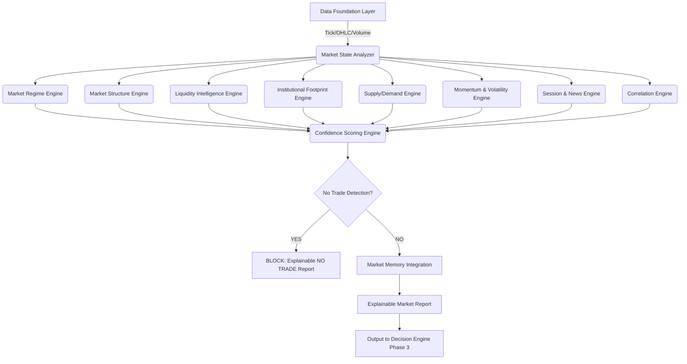

# IATI OS: Institutional Adaptive Trading Intelligence Operating System
## Phase 2: Market Intelligence Engine & Architecture Specification

Dokumen ini merupakan spesifikasi rasmi untuk Fasa 2 (Market Intelligence Engine) bagi IATI OS. Matlamat enjin ini adalah untuk *memahami* keadaan pasaran secara holistik berdasarkan gabungan pelbagai metrik dan bukannya bergantung kepada isyarat "Indicator = Signal". Ia merangkumi pengesanan regime, struktur pasaran, kecairan, momentum, dan keyakinan pasaran secara keseluruhan.

---

### 1. Market Intelligence Architecture & Module Relationship Diagram

Senibina Market Intelligence Engine direka bentuk sebagai agregator berbilang dimensi yang menerima data dari Data Foundation (Phase 1) dan mensintesis keadaan pasaran semasa.



---

### 2. Data Input Requirement

Untuk membolehkan enjin Market Intelligence berfungsi dengan ketepatan institusi, input berikut adalah mandatori:

*   **Multi-Timeframe Price Feed:** OHLC & Tick data untuk timeframe utama (W1, D1, H4) dan timeframe pelaksanaan (H1, M15, M5).
*   **Volume & Order Flow:** Tick volume, real volume (jika ada data berpusat), dan delta pesanan.
*   **Volatility Metrics:** Average True Range (ATR), Bollinger Bands Width.
*   **Momentum Oscillators:** RSI, MACD Histogram, ADX.
*   **Macro/Event Data:** Economic Calendar API (Masa kejadian, jangkaan, impak).
*   **Correlation Matrix:** Data masa nyata pasangan berkorelasi (EURUSD vs GBPUSD vs DXY).

---

### 3. Market State Schema

Setiap analisis menghasilkan **Market State Object** yang akan disimpan ke dalam *Short-Term Memory* dan dihantar ke Decision Engine.

```json
{
  "symbol": "EURUSD",
  "timeframe": "H4",
  "timestamp": "2026-08-06T10:00:00Z",
  "trend": "bullish",
  "structure": "higher_high",
  "regime": "trending",
  "volatility": "expansion",
  "momentum": "strong",
  "liquidity_state": "sweep_detected",
  "supply_demand": "near_fresh_demand",
  "session": "London",
  "news_status": "clear",
  "risk_level": "normal",
  "confidence_score": 87,
  "action_flag": "PERMITTED"
}
```

---

### 4. Regime Detection Logic & Algorithm Design

Enjin *Market Regime* menggunakan sistem "Weight-of-Evidence" untuk menentukan fasa pasaran tanpa meletakkan kepercayaan penuh pada satu indikator tunggal.

*   **TRENDING (Bullish/Bearish):**
    *   *Kriteria:* Harga > EMA50, EMA50 > EMA200 + Struktur (HH/HL) + ADX > 25.
*   **RANGE (Sideways/Compression):**
    *   *Kriteria:* Harga berayun sekitar EMA50 (flat slope) + ADX < 20 + Bollinger Bands menguncup (Compression).
*   **VOLATILITY (Expansion/Contraction):**
    *   *Kriteria:* ATR semasa berbanding ATR(20) Purata Bersejarah.
*   **TRANSITION (Breakout/Reversal/Accumulation/Distribution):**
    *   *Kriteria:* Volum meletup (Spike) menembusi zon julat + Perubahan Struktur (Break of Structure - BoS).
*   **EVENT REGIME (News Impact):**
    *   *Kriteria:* Window waktu ±30 minit dari Berita Impak Tinggi (High Impact).

---

### 5. Scoring Framework (Market Confidence Score)

Setiap subsistem memberikan skor berwajaran kepada keadaan keseluruhan. Skor ini menentukan sama ada keadaan pasaran layak untuk dinilai oleh sistem pelaksanaan (Decision Engine).

| Bukti Analisis | Wajaran (Maksimum) | Kriteria Skor |
| :--- | :---: | :--- |
| **Trend Alignment (MTF)** | 20 | H4, H1 & M15 selaras = 20/20. Bercanggah = 0/20. |
| **Market Structure (BoS/ChoCh)** | 20 | Jelas membentuk struktur HH/HL = 20/20. |
| **Liquidity & Footprint** | 15 | Sweep pada zon utama (Liquidity Pool) = 15/15. |
| **Momentum (ADX, RSI, MACD)** | 15 | Momentum kuat dan selari dengan arah trend = 15/15. |
| **Volatility & Risk** | 10 | Volatiliti normal (Bukan melampau) = 10/10. |
| **Session & News** | 10 | Waktu optimum (Contoh: London) dan tiada berita = 10/10. |
| **Correlation Check** | 10 | Tiada risiko pendedahan berganda (Over-exposure) = 10/10. |
| **JUMLAH KEYAKINAN** | **100** | **Cut-off point untuk trade: >= 75/100** |

---

### 6. No Trade Detection (Circuit Breaker)

Enjin diwajibkan menjana output **NO TRADE** sekiranya mana-mana kriteria kritikal dipenuhi:
1.  *Conflicting Timeframe:* H4 Bullish ekstrim, M15 Bearish ekstrim tanpa pembentukan struktur sokongan.
2.  *Low Liquidity/Extreme Spread:* Semasa peralihan sesi (Asian open).
3.  *News Risk:* 30 minit sebelum/selepas NFP, FOMC, CPI.
4.  *Poor Evidence:* Market Confidence Score < 75.

---

### 7. Explainable Market Report (Output)

Setiap analisis sintesis pasaran perlu dibungkus dalam format laporan yang boleh dibaca dan diaudit (Explainable AI):

```text
==================================================
MARKET INTELLIGENCE REPORT: EURUSD
==================================================
Timestamp  : 2026-08-06 14:00:00 (London Session)
Regime     : Trending (Bullish) - Expansion Phase
Confidence : 89% (HIGH QUALITY)

EVIDENCE BREAKDOWN:
- Structure (18/20): Higher High (HH) terukir jelas pada H1.
- Liquidity (15/15): Sell-side liquidity sweep dikesan pada paras 1.0920.
- Momentum (14/15) : ADX = 31 (Strong Trend), MACD histogram expanding.
- Volatility (10/10): Normal (ATR=15 pips/hour), no anomalies.
- Session (10/10)  : Mid-London, high liquidity.
- News (10/10)     : Clear. Tiada laporan impak tinggi untuk 4 jam berikutnya.

ACTION FLAG: PERMITTED
System Status: Menunggu Decision Engine mencari entri optimum (Retest/Order Block).
==================================================
```

---

### 8. Testing Method

*   **Regime Classification Backtesting:** Menilai secara historis sejauh mana sistem tepat membezakan `Trending` vs `Ranging` menggunakan set data berlabel (Machine Learning).
*   **Correlation Stress Test:** Simulasi pasaran (seperti USD flash crash) untuk memastikan enjin dengan pantas membeku (block) pesanan berlebihan arah USD.
*   **Walk-Forward Profiling:** Memantau keyakinan pasaran vs Win Rate sebenar pada fasa tertentu (Adakah skor keyakinan > 85 benar-benar memberikan pulangan stabil di akaun demo?).

---

### 9. Edge Cases

*   **Flash Crash/Black Swan:** Volatiliti tiba-tiba melonjak 500% dalam masa 1 minit. Enjin Volatility akan membatal (override) semua signal dan menjana `NO TRADE (Extreme Risk)`.
*   **Holiday/Thin Markets:** Hujung tahun atau cuti perbankan. Enjin akan mengesan ketiadaan profil "Session" dan spread luar biasa lalu menyekat dagangan.
*   **Data Feed Latency:** Jika timestamp "Market State" ketinggalan > 1000ms daripada harga tick broker, sistem melabel state sebagai `STALE` dan menolak sebarang tindakan.

---

### 10. Implementation Roadmap (Phase 2 to Phase 3)

1.  **Tahap 1:** Membangunkan Logik Asas Analisis (Trend, Structure, Momentum).
2.  **Tahap 2:** Membina Enjin Market Regime & Pengesanan Kemeruapan (Volatility Detection).
3.  **Tahap 3:** Integrasi Sistem Kumpulan Kecairan (Liquidity Pool & Sweep).
4.  **Tahap 4:** Membina Matriks Korelasi Keselamatan Risiko.
5.  **Tahap 5:** Sistem Penilaian Keyakinan (Confidence Scoring Framework) dan Penjanaan Explainable Market Report.
6.  **Tahap 6 (Persediaan Phase 3):** Membina saluran (pipeline) untuk Market Report disalurkan terus kepada Decision Engine (Fasa 3).
