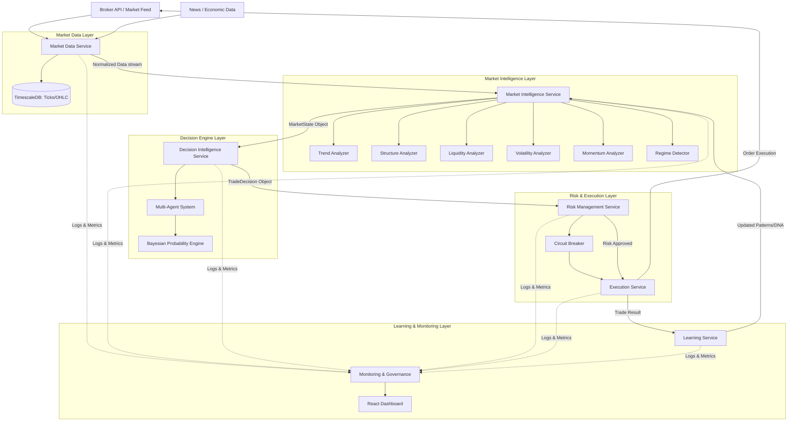

# IATI OS: Institutional Adaptive Trading Intelligence Operating System
## Master Architecture & Development Blueprint

Dokumen ini merupakan Rangka Kerja Induk (Master Framework) bagi pembinaan IATI OS. Ia menggabungkan semua fasa (Foundation, Market Intelligence, Decision, Risk, Execution, Learning, Monitoring) ke dalam satu pelan pelaksanaan pembangunan yang komprehensif.

---

### 1. Final Architecture Diagram

Seni bina IATI OS direka berdasarkan *Event-Driven Clean Architecture* yang memisahkan perkhidmatan (services) kepada modul-modul yang bebas (independent) dan berskala (scalable).



---

### 2. Technology Decision Explanation

Pemilihan teknologi (Tech Stack) didorong oleh keperluan pemprosesan kuantitatif, analisis pembelajaran mesin (ML), pengurusan pangkalan data siri masa (time-series), dan pemerhatian kependaman rendah (low-latency observability).

*   **Backend (Core Services, AI, ML): Python (FastAPI)**
    *   *Sebab:* Python adalah ekosistem terbaik untuk analisis kuantitatif (Pandas, NumPy), pemodelan Bayesian, dan integrasi ejen AI (LangChain / Gemini SDK). FastAPI menyokong *asynchronous programming* yang kritikal untuk pemprosesan API kelajuan tinggi dan integrasi WebSocket.
*   **Database (Time-Series & Relational): PostgreSQL + TimescaleDB**
    *   *Sebab:* Menggabungkan integriti data hubungan (Relational) untuk rekod perdagangan/pengguna dengan kuasa siri masa (TimescaleDB) untuk memproses jutaan rekod tick/lilin (candles) dengan pantas.
*   **Caching & Message Broker: Redis**
    *   *Sebab:* Sangat pantas untuk menyimpan *Short-Term Memory* (Market State semasa) dan berfungsi sebagai *Event Bus* (Pub/Sub) antara perkhidmatan mikroskopik (microservices).
*   **Frontend (Dashboard): React.js / Next.js + Tailwind CSS**
    *   *Sebab:* Moden, reaktif, dan mampu mengendalikan kemas kini *real-time* (WSS) untuk memantau status kesihatan sistem dan keputusan AI.
*   **Infrastructure: Docker & Kubernetes (Deployment)**
    *   *Sebab:* Memastikan setiap modul (Market Data, Decision, Execution) berjalan secara berasingan. Jika satu modul gagal, ia tidak menjatuhkan keseluruhan OS.

---

### 3. Database Entity Relationship Diagram (ERD)

Reka bentuk pangkalan data dioptimumkan untuk kelajuan penulisan (write-speed) data pasaran dan kelajuan bacaan analitik untuk jurnal & pembelajaran.

```mermaid
erDiagram
    MARKET_DATA {
        string symbol PK
        timestamp time PK
        string timeframe PK
        float open
        float high
        float low
        float close
        float tick_volume
    }
    MARKET_STATES {
        string state_id PK
        timestamp time
        string symbol
        string regime
        string volatility
        string liquidity_event
    }
    TRADE_DECISIONS {
        string decision_id PK
        timestamp time
        string symbol
        string action
        float confidence
        string risk_level
        json evidence
        string xai_explanation
    }
    ORDERS {
        string order_id PK
        string decision_id FK
        string status
        float requested_size
        float executed_price
        float slippage
    }
    TRADE_RESULTS {
        string trade_id PK
        string order_id FK
        float pnl
        float mae
        float mfe
        string root_cause_diagnosis
    }
    KNOWLEDGE_BASE {
        string pattern_id PK
        string symbol
        string regime
        float historical_win_rate
        float expected_value
    }

    MARKET_DATA ||--o{ MARKET_STATES : "generates"
    MARKET_STATES ||--o{ TRADE_DECISIONS : "informs"
    TRADE_DECISIONS ||--o| ORDERS : "triggers"
    ORDERS ||--o| TRADE_RESULTS : "results in"
    TRADE_RESULTS }o--|| KNOWLEDGE_BASE : "updates"
```



---

### 4. Repository Structure

Struktur folder direka berteraskan *Domain-Driven Design (DDD)* untuk mengekalkan kebersihan kod dan pengasingan kebimbangan (Separation of Concerns).

```text
/iati-os
├── /backend
│   ├── /api                    # REST API routes and endpoints (FastAPI)
│   ├── /core                   # Configuration, Security, Error Handling, Logger
│   ├── /database               # DB connection, ORM models (SQLAlchemy/SQLModel)
│   ├── /services               # Core business logic domains
│   │   ├── /market_data        # Tick ingestion, validation, OHLC generation
│   │   ├── /intelligence       # Regime detection, liquidity, momentum
│   │   ├── /decision           # Multi-agent analysis, Bayesian probability
│   │   ├── /risk               # Position sizing, drawdown control, portfolio risk
│   │   ├── /execution          # Broker integration, slippage monitor, orders
│   │   └── /learning           # Trade analysis, pattern discovery
│   ├── /ml                     # Machine learning models, training pipelines, evaluators
│   ├── /analytics              # Performance KPIs (Sharpe, Profit Factor)
│   └── /monitoring             # System health, alerts, Prometheus metrics
├── /frontend
│   ├── /src
│   │   ├── /components         # UI components (shadcn/ui)
│   │   ├── /hooks              # Custom React hooks (WSS connections)
│   │   ├── /pages              # Dashboard, Trade History, AI Insights
│   │   └── /services           # API clients to backend
├── /database
│   ├── /migrations             # Alembic/Flyway migration scripts
│   └── /schema                 # Raw SQL schema definitions (TimescaleDB specifics)
├── /tests
│   ├── /unit                   # Unit tests per module
│   ├── /integration            # Service-to-service tests
│   └── /backtest               # Walk-forward, Monte Carlo simulators
├── /docker                     # Dockerfiles and docker-compose.yml
└── /docs                       # System architecture, API documentation
```

---

### 5. Development Roadmap (Incremental Implementation)

Pembangunan akan dilaksanakan dalam **10 Sprint**. Tiada fungsi akan digabungkan ke modul seterusnya sehingga modul semasa lulus 100% *Unit Tests*.

*   **SPRINT 1: Foundation Layer** - Setup repository, Docker, PostgreSQL/TimescaleDB, Redis, FastAPI boilerplate, Security (JWT/API Keys).
*   **SPRINT 2: Database Layer** - Cipta jadual ERD (Migrations), pengurusan *time-series*, *seed data*.
*   **SPRINT 3: Market Data Service** - Sambungan Broker (Mock/Demo API), penyedutan harga (price ingestion), validasi, penyimpanan.
*   **SPRINT 4: Market Intelligence Service** - Pembangunan Enjin Trend, Volatiliti, Struktur, dan pengesanan Rejim. Output: `MarketState Object`.
*   **SPRINT 5: Decision Engine** - Seni bina *Multi-Agent*, Kalkulator Bayesian, pengiraan *Expected Value (EV)*, penjanaan Laporan Keputusan.
*   **SPRINT 6: Risk Management Service** - Kalkulator saiz posisi dinamik (ATR-based), pengurusan *Drawdown*, Had Korelasi, *Circuit Breaker*.
*   **SPRINT 7: Execution Service** - Integrasi pengurusan Pesanan (Order routing), pemantauan *Slippage*, Logik *Retry*, penyesuaian pangkalan data.
*   **SPRINT 8: Learning & Analytics Engine** - Enjin bedah siasat (Post-trade analysis), diagnostik Root Cause, kemas kini memori berterusan (Knowledge update).
*   **SPRINT 9: Dashboard & Monitoring** - Pembangunan Frontend React, penyambungan WSS, metrik pemantauan masa nyata (Real-time observability).
*   **SPRINT 10: Validation & Stress Testing** - Simulasi Backtest Realistik, Analisis *Walk-Forward*, Ujian *Monte Carlo*, mod *Shadow Trading*.

---
**Sedia Untuk Kelulusan.**
Sila semak Pelan Seni Bina Induk (Master Architecture Blueprint) di atas. Apabila diluluskan, kita akan memulakan **SPRINT 1: Foundation Layer**.
