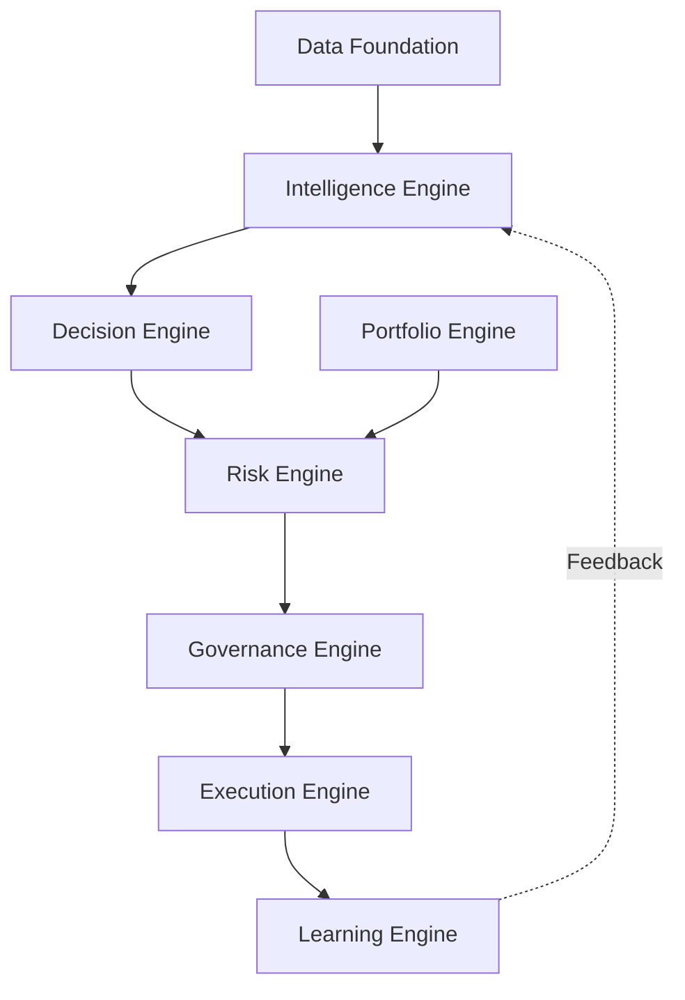

# IATI OS: Institutional Adaptive Trading Intelligence Operating System
## PHASE X: ARCHITECTURE FREEZE & BUILD MANIFEST (PRODUCTION IMPLEMENTATION SPECIFICATION)

This document is the **FROZEN ARCHITECTURE SPECIFICATION** for IATI OS. It serves as the single source of truth for all developers, AI coding agents, reviewers, and deployment pipelines. No architecture changes are permitted beyond this document.

---

## SECTION 1: System Vision
**IATI OS** is a fully governed, autonomous, institutional-grade AI trading platform. It processes raw market data, identifies structural opportunities using machine learning, makes deterministic and probabilistic decisions via a multi-agent system, enforces strict risk and governance boundaries, executes trades across distributed broker networks, and learns continuously from its own performance.

## SECTION 2: Architecture Principles
1. **Modularity:** Everything is a distinct service or component. No monolithic logic.
2. **Event-Driven:** Core inter-service communication utilizes an Event Bus (Kafka/RabbitMQ) for asynchronous processing.
3. **Governance-First:** Every action must pass through the `Risk Engine` and `Governance Engine`. No exceptions.
4. **Adapter Pattern:** Brokers, exchanges, and data providers are abstracted behind adapters. Never hardcode third-party logic.
5. **Fail-Safe & Recoverable:** Assume all components will fail. Enforce Graceful Degradation, Circuit Breakers, and Auto-Rollback.
6. **Zero-Trust Security:** Principle of least privilege, strict RBAC, and immutable audit logging.

## SECTION 3: Coding Standards & AI Coding Rules
**AI Coding Rules (Mandatory):**
* **Read this manifest** before writing any code.
* **Never modify** the frozen architecture.
* **Never change** database schemas without proper migration files.
* **Never bypass** governance, risk limits, or audit logging.
* **Never hardcode** configuration values or secrets.
* **Always write tests** (Unit, Integration) for every feature.
* **Always document APIs** (Swagger/OpenAPI).

**Quality Gates (Pull Requests):**
1. Architecture Review 
2. Static Analysis & Linting 
3. Unit & Integration Tests pass (minimum 85% coverage)
4. Security Scan (SAST/DAST)
5. Performance Check (Latency < SLA limits)
6. Peer Approval

## SECTION 4: Technology Stack
* **Language:** TypeScript / Node.js (Primary), Python (Quant ML models).
* **Database:** PostgreSQL (Relational/Config), TimescaleDB/InfluxDB (Time-Series Data), Redis (Caching/Fast State).
* **Message Broker:** Apache Kafka or RabbitMQ.
* **MLOps:** MLflow, PyTorch/TensorFlow for ML models.
* **Infrastructure:** Docker, Kubernetes (K8s), Terraform for IaC.
* **Observability:** Prometheus, Grafana, Datadog, ELK Stack.

## SECTION 5: Repository Structure
```text
/iati-os-platform
├── /apps                  # Microservices entry points
│   ├── /market-data
│   ├── /intelligence
│   ├── /decision-agent
│   ├── /risk-governance
│   ├── /execution-router
│   ├── /portfolio
│   └── /mlops
├── /packages              # Shared libraries
│   ├── /core-types
│   ├── /event-bus
│   ├── /database
│   ├── /broker-adapters
│   └── /security
├── /infrastructure        # IaC, K8s manifests, Dockerfiles
├── /docs                  # Build Manifest & Phase Specifications
└── /tests                 # E2E and Integration Tests
```

## SECTION 6: Master Database Specification
(Consolidated ERD Core Entities)
* `assets`, `market_prices`, `market_sessions` (Data)
* `market_states`, `market_regimes` (Intelligence)
* `trade_decisions`, `agent_votes`, `confidence_scores` (Decision)
* `risk_profiles`, `exposure_records`, `drawdown_records` (Risk)
* `brokers`, `broker_accounts`, `orders`, `positions` (Execution)
* `system_versions`, `audit_logs`, `permission_logs` (Governance)
* `models`, `feature_store`, `training_runs`, `drift_reports` (MLOps)

## SECTION 7: API Contracts (Summary)
All services communicate via gRPC (for high-speed internal calls) and REST (for external facing / UI calls).
* `POST /api/execution/place-order`: Strictly restricted. Only accepts signed requests from the Governance Engine.
* `GET /api/market/state`: Streams current intelligence and regime data.
* `POST /api/model/deploy`: Protected MLOps endpoint requiring multi-signature approval.

## SECTION 8: Domain Models
Every domain must define strict TypeScript interfaces/types.
Example: `TradeDecision` object MUST include `symbol`, `direction`, `timeframe`, `market_state`, `strategy`, `evidence`, `agent_votes`, `confidence`, `risk_score`, `expected_value`, `approval_status`, and `explanation`.

## SECTION 9: Service Architecture & Dependency Graph


## SECTION 10: Event Architecture
Event Bus enforces decoupling.
* **Events:** `MarketDataUpdated`, `PatternDetected`, `TradeProposed`, `RiskCleared`, `GovernanceApproved`, `OrderPlaced`, `OrderFilled`, `PositionClosed`, `ModelDriftDetected`.

## SECTION 11: Risk Governance
* Hard limits on Exposure, Margin, Drawdown, and Frequency.
* Circuit Breaker integration on all execution adapters.
* Autonomy Level Control (Level 0 to 5) strictly limits AI operational boundaries.

## SECTION 12: Portfolio Engine
* Balances risk across Multi-Asset and Multi-Broker accounts.
* Manages Correlation, Capital Allocation, and Synthetic positions.

## SECTION 13: AI Decision Engine
* Multi-Agent Consensus: Trend, Structure, Liquidity, Momentum, and Forecast Agents must vote.
* A Chief Decision Agent aggregates votes. High confidence is required to emit a `TradeProposed` event.

## SECTION 14: Learning Engine
* Continuous feedback loop. Stores Prediction vs Outcome.
* Adaptive Weighting adjusts agent influence based on market regime success rates.

## SECTION 15: Strategy Factory
* Automated formulation and backtesting of structural rules.
* Output strategies must pass Walk-Forward and Monte Carlo testing before entering the Decision Engine.

## SECTION 16: Execution Engine
* Smart Order Routing across multiple configured broker adapters.
* Handles slippage limits, iceberg orders, and position trailing.

## SECTION 17: Monitoring (Observability)
* Model Health Engine tracks prediction decay.
* System Health tracks latency, error rates, and API limits.
* Operations Dashboard visualizes real-time metrics.

## SECTION 18: Security
* Enterprise security platform. Zero Trust.
* Centralized Secret Management (Vault). No keys in code.
* Immutable Audit Engine records every configuration change and override.

## SECTION 19: Deployment
* Staged Rollout: `Dev` ➔ `Staging` (Shadow/Paper) ➔ `Limited Prod` ➔ `Full Prod`.
* Multi-Region Cloud deployment with high-availability failover.

## SECTION 20: Testing Strategy & Definition of Done
**Definition of Done (DoD) per Module:**
* **Purpose:** Clearly documented.
* **Unit Tests:** >= 85% coverage.
* **Integration Tests:** End-to-end event flow verified.
* **Performance:** Execution modules latency < 50ms.
* **Failure Conditions:** Graceful degradation pathways tested.

## NON-FUNCTIONAL REQUIREMENTS
* **Scalability:** Horizontal scaling via stateless microservices.
* **Latency:** <50ms for decision-to-execution pipeline.
* **Reliability:** 99.99% uptime target with Multi-AZ redundancy.
* **Auditability:** 100% of actions and AI rationales are stored immutably.
* **Recoverability:** RTO < 5 mins, RPO < 1 min.

---
**STATUS: ARCHITECTURE FROZEN.**
Proceed strictly with implementation according to this master specification. No further conceptual architectural expansions are permitted.
