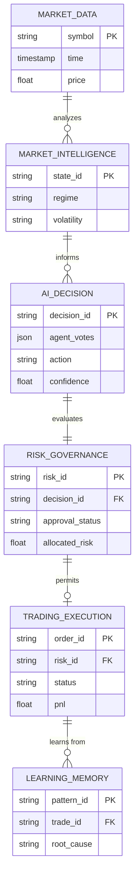
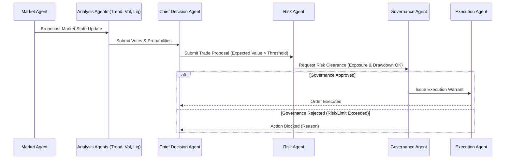

# IATI OS: Institutional Adaptive Trading Intelligence Operating System
## Phase 16: Master System Integration & OS Architecture

Dokumen ini merupakan spesifikasi rasmi untuk Fasa 16 (Master System Integration & OS Architecture) bagi IATI OS. Ia merupakan pelan induk yang menyatukan kesemua 15 fasa terdahulu ke dalam satu Sistem Operasi Kecerdasan Perdagangan (AI Trading Operating System) yang komprehensif, modular, dan boleh diskala.

---

### 1. Complete Architecture Diagram

Seni bina IATI OS ialah platform bersepadu yang memproses data mentah sehingga menjadi pelaksanaan pasaran melalui sempadan tadbir urus (Governance).

```mermaid
flowchart TD
    subgraph Data Foundation
        DF[Market Feed, Ticks, Volume, Sentiment, Economic Data]
    end

    subgraph Intelligence Layer
        MI[Market Intelligence: Trend, Structure, Liquidity]
        FI[Forecast Intelligence: Scenario, Probability]
        MS[Microstructure: Liquidity Map, Order Behaviour]
    end

    subgraph Decision Layer
        MA[Multi-Agent Decision System]
        CDA[Chief Decision Agent]
    end

    subgraph Control Layer (Risk & Governance)
        RE[Risk Intelligence Engine]
        GOV[AI Governance & Autonomy Control]
    end

    subgraph Execution & Portfolio Layer
        PE[Portfolio Intelligence Engine]
        EE[Execution Engine]
    end

    subgraph Learning & Human Layer
        LE[Adaptive Learning Engine]
        CP[AI Trading Copilot]
    end

    DF --> MI & FI & MS
    MI & FI & MS --> MA
    MA --> CDA
    CDA --> PE
    PE --> RE
    RE --> GOV
    
    GOV -- Approved --> EE
    GOV -- Blocked/Review --> CP
    
    EE --> LE
    LE -.->|Updates Logic| MI & MA
    CP <-->|Feedback & Coaching| LE & GOV
```

---

### 2. Component Dependency Map

Pemetaan ini menunjukkan tahap kebergantungan (dependency) antara modul. Pematuhan kepada reka bentuk dipacu peristiwa (Event-Driven Architecture) memastikan modul utama tidak tergendala jika sub-modul gagal.

*   **Execution Engine** bergantung MESTI (Strictly Depends) pada **Governance Engine** dan **Risk Engine**.
*   **Risk Engine** bergantung pada **Portfolio Intelligence** (untuk pendedahan - *exposure*) dan **Decision Layer** (untuk butiran *trade*).
*   **Decision Layer** bergantung pada **Intelligence Layer** untuk memahami keadaan pasaran.
*   **AI Copilot** berfungsi sebagai modul peninjau (Observer) yang boleh membaca dari semua modul, tetapi tidak boleh secara paksa memintas (bypass) *Risk* atau *Governance*.

---

### 3. Final Database ERD (Core Tables)

Pangkalan data dipisahkan secara logik kepada 8 Kumpulan untuk mengurus skalabiliti Siri Masa (Time-series) dan Analitik.



---

### 4. API Map (Service Contracts)

Reka bentuk **API First** mentakrifkan titik akhir interaksi dalam sistem mikroskopik (microservices).

*   **Market Data API (gRPC / WSS):** `StreamTicks()`, `GetHistoricalOHLC()`.
*   **Intelligence API (REST):** `GET /api/intelligence/regime/{symbol}`, `GET /api/intelligence/liquidity-map`.
*   **Decision API (REST):** `POST /api/decision/evaluate` ➜ Mengembalikan *Trade Decision Object*.
*   **Risk API (REST):** `POST /api/risk/validate-exposure` ➜ Menyemak impak portfolio dan mengira lot.
*   **Execution API (REST / FIX Protocol):** `POST /api/execution/place-order`, `GET /api/execution/status`.
*   **Learning & Copilot API (REST / WSS):** `GET /api/learning/insights`, `POST /api/copilot/chat`.

---

### 5. Agent Communication Protocol

Ejen dilarang melepasi (bypass) struktur autoriti. Protokol komunikasi ditetapkan secara berurutan dan terikat (bounded).



---

### 6. Development Sequence (Sprint Roadmap)

Pembangunan dilaksanakan secara berperingkat berdasarkan susunan kebergantungan.

1.  **PHASE 1 (Foundation MVP):** Database, API Routing, Authentication, Basic Dashboard.
2.  **PHASE 2 (Market Intelligence):** Trend, Structure, Regime, Volatility parsers.
3.  **PHASE 3 (Decision Intelligence):** Multi-Agents, Evidence Engine, Probability.
4.  **PHASE 4 (Risk System):** Position sizing, Exposure limits, Portfolio Protection.
5.  **PHASE 5 (Execution):** Broker API integration, Order Management.
6.  **PHASE 6 (Learning):** Memory banks, Trade Analysis, Pattern Discovery.
7.  **PHASE 7 (Portfolio):** Multi-asset coordination, Asset correlation, Allocation.
8.  **PHASE 8 (AI Copilot):** Conversational AI, Journaling, Human Coaching.
9.  **PHASE 9 (Autonomy):** Governance limits, Permission handling, Safety switches.

---

### 7. MVP Scope (IATI OS v1.0)

Skop minimum berdaya maju (Minimum Viable Product) memfokuskan kepada analisis dan sokongan, bukan autonomi.

*   **Penyertaan (Must Contain):** Market Data Feeds, Market Analysis, Decision Scoring, Risk Engine, Paper Trading (Simulasi Pelaksanaan), Trade Journal, dan Basic Learning.
*   **Pengecualian (DO NOT start with):** Autonomi penuh (Full Autonomous Trading dengan wang sebenar) diasingkan daripada MVP untuk mengelakkan risiko kewangan.

---

### 8. Production Scope (IATI OS v2.0)

Peningkatan ke fasa institusi pengeluaran langsung.

*   **Penyertaan Tambahan:** Live Execution (Duit Sebenar), Pengurusan Portfolio Pelbagai Aset, AI Copilot, Strategy Factory (Pembuatan & Pengoptimuman Strategi), dan Autonomous Mode (dengan pengawasan Governance).

---

### 9. Testing Strategy

Untuk mengelakkan pepijat logik perdagangan yang boleh menyebabkan kerugian kewangan.

1.  **Unit & Integration Test:** Menggunakan persekitaran CI/CD untuk memastikan setiap modul memproses logik matematik dengan tepat (contoh: kalkulator SL/TP).
2.  **Performance Test:** Memastikan laluan API Market Data ke Execution kependaman rendah (<50ms).
3.  **Failure Test:** Memutuskan pangkalan data / sambungan broker secara sengaja untuk menguji algoritma pemulihan diri (Recovery).
4.  **Trading Tests:** Backtest (simulasi spread/slippage), Walk Forward Analysis (out-of-sample), Monte Carlo (risiko rawak), dan Shadow Trading (validasi *live* tanpa penempatan pesanan).

---

### 10. Deployment Strategy

1.  **Infrastructure (Cloud Native):** Kluster Kubernetes (K8s) di AWS/GCP untuk pengurusan kontena mikro.
2.  **Databases:** Instans terurus untuk PostgreSQL/TimescaleDB memastikan *uptime* tinggi dan replikasi data harian (Disaster Recovery).
3.  **Pipelines (CI/CD):** 
    *   `Dev` (Pembangunan Ciri) ➜ `Staging` (Shadow Trading/Backtesting) ➜ `Prod` (Live Execution).
4.  **Monitoring:** Alat pemantauan infrastruktur (Datadog/Prometheus + Grafana) dipautkan terus dengan AI Governance Incident Reports bagi memberikan makluman sekiranya anomali dikesan.
