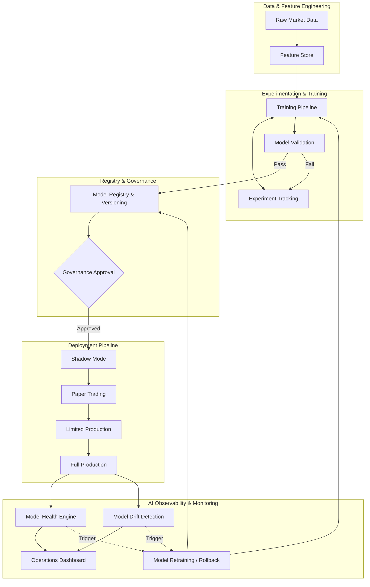
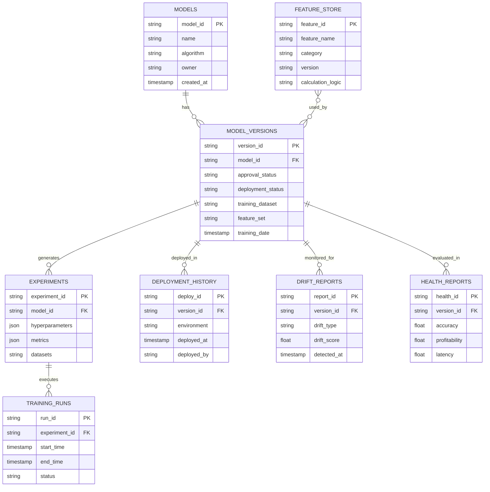

# IATI OS: Institutional Adaptive Trading Intelligence Operating System
## Phase 27: MLOps, Model Lifecycle & AI Operations Engine

Dokumen ini merupakan spesifikasi rasmi untuk Fasa 27 (MLOps, Model Lifecycle & AI Operations Engine) bagi IATI OS. Fasa ini direka untuk membina platform AI pengeluaran (production AI platform) yang lengkap bagi menguruskan model pembelajaran mesin dari mula hingga akhir. 

**Prinsip Teras (Core Principle):** *Sistem dilarang sama sekali menyebarkan (deploy) sebarang model terus ke pengeluaran (production).* Setiap model mesti melalui fasa Latihan ➜ Pengesahan ➜ Kelulusan ➜ Mod Bayang (Shadow) ➜ Kertas (Paper) ➜ Pengeluaran Terhad ➜ Pengeluaran Penuh.

---

### 1. MLOps Architecture & AI Observability

Seni bina MLOps mengasingkan persekitaran penyelidikan/latihan daripada persekitaran pelaksanaan secara langsung (live execution).

---

### 2. Model Lifecycle Diagram

Kitaran hayat bagi setiap model ML dalam IATI OS dipantau dengan ketat untuk mengelakkan *degradation* (kemerosotan prestasi).

1.  **Development / Training:** Pengekstrakan ciri dari *Feature Store*, melatih dengan data sejarah, hyperparameter tuning.
2.  **Validation:** Penilaian metrik ketepatan (Accuracy, Precision, Recall, F1, Profitability). Model ditolak jika gagal.
3.  **Shadow Deployment:** Model dijalankan pada data langsung tetapi **tidak** mengeksekusi trade. Outputnya dibandingkan dengan model produksi semasa.
4.  **Paper Validation:** Model mengeksekusi *trade* menggunakan wang maya / akaun demo.
5.  **Limited / Canary Production:** Eksekusi menggunakan wang sebenar pada saiz kedudukan (position size) yang sangat kecil.
6.  **Full Production:** Penggunaan pada tahap institusi sepenuhnya.

---

### 3. Database ERD (MLOps & Registry)

Skema pangkalan data untuk mengurus model, eksperimen, dan penjejakan prestasi.

---

### 4. Feature Store Design

Gudang pusat terurus yang menyimpan, mengubah, dan menyajikan ciri-ciri data (features) untuk latihan (training) dan inferens (inference) bagi mengelakkan kebocoran data (data leakage) dan penulisan semula kod.

*   **Categories:** Trend Features, Volatility Features, Liquidity Features, Momentum Features, Forecast Features, Risk Features.
*   **Attributes:** Setiap ciri (feature) mestilah *Versioned*, *Reusable* (merentas model), dan *Documented* dengan logik perhitungannya.
*   **Serving:** *Offline Store* (untuk latihan kumpulan / batch) dan *Online Store* (pembacaan kependaman rendah < 10ms untuk inferens langsung).

---

### 5. Deployment Pipeline & Rollback Engine

*   **Deployment Pipeline:** Dikuatkuasakan melalui *Role-Based Access Control (RBAC)*. Model dari *Shadow* ke *Paper* ke *Production* memerlukan aliran kelulusan berbilang tandatangan (Multi-signature approval). Tiada pelaksanaan terus (*No direct production deployment*).
*   **Rollback Engine:** Sekiranya model produksi semasa (Current Production Model) mengalami ralat atau berprestasi buruk:
    *   *Instant / Emergency Rollback:* Mengembalikan ke `version` stabil terakhir dalam beberapa saat.
    *   *Sistem Audit:* Segala pengunduran (rollback) akan memelihara sejarah audit (preserve audit history) - tiada rekod dipadam.

---

### 6. Drift Detection & Model Health Engine

Pemantauan (*AI Observability*) berjalan 24/7 ke atas setiap inferens (inference) model.

*   **Model Drift Detection:**
    *   *Feature Drift:* Perubahan pada taburan input berbanding data latihan (contohnya, kemeruapan VIX melonjak).
    *   *Concept Drift:* Hubungan antara ciri (feature) dan corak sasaran berubah secara struktural.
    *   *Prediction/Performance Drift:* Kadar ketepatan (accuracy) model mula merosot secara berterusan (Performance Decay).
*   **Model Health Engine:** Mengira skor kesihatan (Model Health Score) berpandukan: *Prediction Accuracy, Calibration, Profitability, Consistency, Latency, dan Error Rate.*

---

### 7. API Specification (MLOps)

Senarai endpoint REST API bagi pengurusan operasi model:

*   **`POST /api/v1/model/train`** : Mencetuskan perancangan latihan automatik menggunakan *Training Pipeline*.
*   **`POST /api/v1/model/validate`** : Menilai kualiti metrik model berbanding set pengesahan (validation set).
*   **`POST /api/v1/model/deploy`** : Menganjak model ke fasa pelancaran seterusnya (Cth: Shadow ➜ Paper).
*   **`POST /api/v1/model/rollback`** : Melaksanakan pengunduran serta-merta ke versi sebelumnya.
*   **`GET /api/v1/model/health`** : Mendapatkan metrik dan markah kesihatan model semasa.
*   **`GET /api/v1/model/drift`** : Mendapatkan laporan dan amaran (alerts) berkaitan *Drift Detection*.
*   **`GET /api/v1/model/history`** : Mendapatkan susur galur versi (Model Lineage) dan log kelulusan.

---

### 8. Operations Dashboard Design

Antara muka (UI) Kawalan Pusat AI:

1.  **Registry Panel:** Senarai *Registered Models* mengikut versi dan status (*Shadow/Production*).
2.  **Live Monitoring Widget:** Paparan bagi model pengeluaran semasa (Current Production Model) dengan tolok *Health Score* (0-100).
3.  **Alerts & Drift Board:** Suapan masa nyata untuk amaran *Drift Alerts* dan amaran latensi.
4.  **Deployment History Matrix:** Jadual (Log) penjejakan eksperimen, kemas kini perisian, dan sejarah *Rollback*.

---

### 9. Testing Strategy

Setiap komponen di dalam platform MLOps akan diuji melalui:
*   **Training Pipeline Test:** Menjana set data acuan untuk memastikan prapemprosesan dan pengekstrakan ciri tiada ralat / NaNs.
*   **Validation Logic Test:** Menetapkan ralat ketepatan dengan sengaja untuk memastikan sistem menolak model yang gagal metrik kelulusan (Reject threshold works).
*   **Drift Detection Test:** Menyuntik data pasaran yang asing (Out-of-distribution) untuk memastikan *Drift Alert* dicetuskan.
*   **Rollback Test:** Ujian kependaman (*Latency test*) sewaktu pengunduran sistem diaktifkan (memastikan masa henti / *downtime* sifar).

---

### 10. Production Rollout Plan

Langkah-langkah untuk membawa Sistem MLOps IATI ke fasa pengeluaran:

1.  **Fasa Binaan Gudang Data:** Melengkapkan *Feature Store* dengan penyimpanan luar talian/dalam talian (Redis/PostgreSQL).
2.  **Fasa Binaan Talian Latihan:** Membina *Pipeline* untuk MLflow atau platform setara untuk *Experiment Tracking* dan *Model Registry*.
3.  **Fasa Penempatan Awal:** Mengaktifkan *Shadow Mode*. Model berjalan serentak dengan pasaran langsung untuk membina asas data *Health Score* tanpa berdagang.
4.  **Fasa Go-Live MLOps:** Mengaktifkan *Model Drift Detection*, menyepadukan dengan *Rollback Engine*, dan menaik taraf *Governance Engine* (Phase 15) untuk memberikan persetujuan berdasarkan *Model Health Score*.
