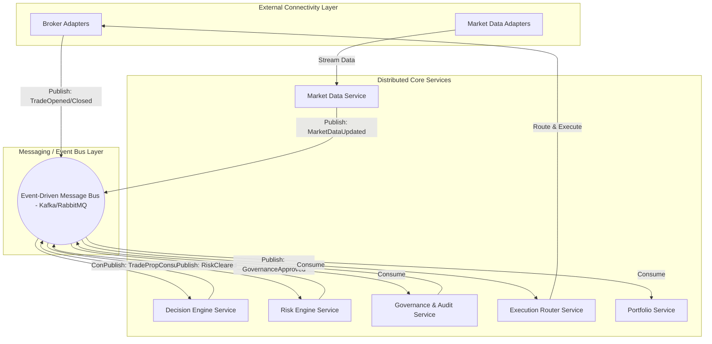
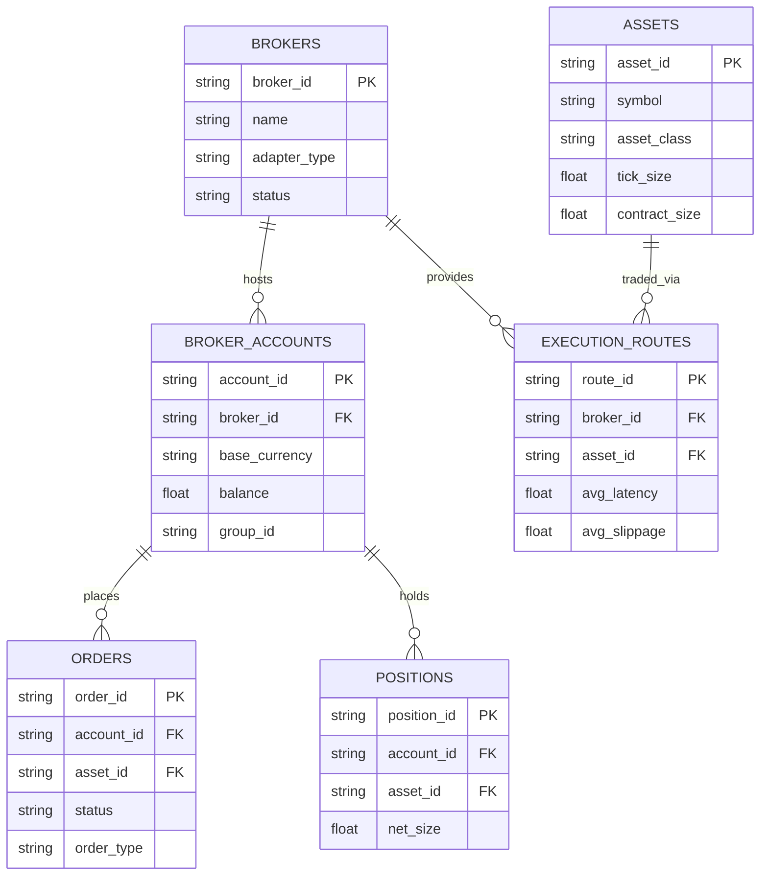

# IATI OS: Institutional Adaptive Trading Intelligence Operating System
## Phase 29: Multi-Asset, Multi-Broker & Distributed Trading Infrastructure

Dokumen ini merupakan spesifikasi rasmi untuk Fasa 29 (Multi-Asset, Multi-Broker & Distributed Trading Infrastructure) bagi IATI OS. Matlamat utama fasa ini adalah untuk membina platform perdagangan berskala global bertaraf institusi yang mampu menyokong pelbagai kelas aset, broker, bursa, dan beroperasi di atas seni bina teragih (distributed architecture).

**Prinsip Teras (Core Principle):** *Dilarang sama sekali menetapkan kod secara kekal (hard-code) untuk menyokong satu broker, satu bursa, atau satu aset. Semua integrasi luaran mesti menggunakan penyesuai (adapters) dan antara muka (interfaces).*

---

### 1. Distributed Architecture & Service Communication Model

Seni bina teragih memisahkan fungsi-fungsi kritikal kepada perkhidmatan mikro (microservices) untuk membenarkan penskalaan mendatar (horizontal scaling) dan pengasingan kesalahan (fault isolation).

**Service Communication Model:**
*   **Asynchronous:** Komunikasi antara perkhidmatan teras menggunakan *Event Bus* untuk memastikan kebebasan pemprosesan (*loose coupling*).
*   **Synchronous (REST/gRPC):** Digunakan untuk tindakan yang memerlukan kebenaran segera, seperti semakan API atau permohonan *override* manual.

---

### 2. Broker Adapter Design & Market Data Abstraction

Lapisan Penyesuai (Adapter Layer) menterjemahkan logik khusus broker kepada bahasa seragam IATI OS.

*   **Broker Adapter Interface:** Semua broker (MT5, Interactive Brokers, OANDA, Binance, Bybit) mematuhi satu kontrak pengaturcaraan yang sama (contohnya: fungsi `connect()`, `placeOrder()`, `getPositions()`). Jika IATI OS ingin menambah broker baharu, hanya *adapter* baharu ditambah tanpa mengubah logik enjin pelaksanaan utama.
*   **Market Data Abstraction:** Data pasaran dilanggan dari pelbagai pembekal (Broker Feed, Exchange Feed, Premium API).
*   **Failover Mechanism:** Jika API penyedia data utama (Primary Data Provider) terputus, *Market Data Service* akan beralih (*failover*) ke penyedia sekunder (Secondary Provider) secara lancar.

---

### 3. Event Bus Design

Seni bina berpacukan peristiwa (Event-driven architecture) membolehkan pemprosesan dan penyampaian beratus-ratus arahan milisaat secara selari.

**Acara Teras (Core Events):**
*   `MarketDataUpdated`: Harga atau *tick* baharu diterima.
*   `TradeProposed`: AI telah mengenal pasti peluang dagangan.
*   `RiskAlert`: Pelanggaran pendedahan (exposure) atau had pengeluaran (drawdown) telah berlaku.
*   `GovernanceApproved`: Arahan telah dilepaskan oleh enjin tadbir urus.
*   `TradeOpened` / `TradeClosed`: Pengesahan (fill) dari broker.
*   `ModelUpdated` / `StrategyApproved`: Peningkatan sistem oleh MLOps.

---

### 4. Database ERD (Infrastructure & Trading)

Pangkalan data direka untuk menyokong pelbagai bursa dan kelas aset, dibahagikan mengikut jenis operasi (Time-Series untuk Harga, Relational untuk Pengurusan).

---

### 5. API Specification (Enterprise Infrastructure)

Piawaian REST API digunakan untuk pengurusan kawalan infrastruktur.

*   **`POST /api/v1/broker/connect`** : Menyambungkan dan mengesahkan adapter broker tertentu.
*   **`GET /api/v1/broker/status`** : Mendapatkan status ketersambungan (ping/health) untuk semua broker/bursa terhubung.
*   **`POST /api/v1/execution/send`** : Menghantar pesanan mentah (kebanyakannya dikendalikan oleh *Event Bus* dalam produksi, tetapi API disediakan untuk pengesahan / override).
*   **`POST /api/v1/execution/cancel`** : Membatalkan pesanan terbuka atau *pending*.
*   **`GET /api/v1/portfolio/accounts`** : Mengakses data semua sub-akaun merentas broker.
*   **`GET /api/v1/market/providers`** : Menyemak sumber dan integriti penyedia data pasaran.
*   **`GET /api/v1/latency/report`** : Menjana laporan prestasi (Decision Latency vs Execution Latency).

---

### 6. Execution Router & Multi-Asset Engine

*   **Multi-Asset Engine:** Aset seperti *Forex, Crypto, Indices, Stocks* memerlukan peraturan pengiraan berbeza. Setiap aset dalam sistem menetapkan parameter metadata (Waktu Dagangan, Saiz Tick, Saiz Kontrak, Peraturan Margin).
*   **Execution Router (Smart Order Routing):** Bertanggungjawab menentukan ke mana pesanan patut dihantar. Ia mengira kualiti pelaksanaan berdasarkan kependaman (Latency), kecairan (Liquidity), dan sebaran (Spread) di antara pelbagai broker, lalu mengeksekusi di destinasi terbaik.

---

### 7. Deployment Architecture (Multi-Region)

Untuk menangani kependaman silang benua (cross-continent latency), platform ini diaktifkan pada awan berbilang rantau (Multi-Region Cloud Deployment).

*   **Region Nodes:** Nod diletakkan berhampiran pelayan bursa kewangan utama.
    *   *Asia (Tokyo/Singapore)* 
    *   *Europe (London/Frankfurt)*
    *   *North America (New York/Chicago)*
*   **Time Synchronization:** NTP Berketepatan Tinggi (High-Precision NTP) bagi mengelakkan sisihan masa (time drift) antara *Decision Engine* dan *Broker Log*.
*   **Regional Failover:** Jika pusat data Eropah tergendala, pelayan ganti di Amerika Utara boleh mengambil alih dengan perubahan DNS / *Global Load Balancer*.

---

### 8. Scalability & Latency Management

*   **Penskalaan Mendatar (Horizontal Scaling):** Menerapkan API tanpa keadaan (*Stateless APIs*) dengan *Queue Processing* (seperti Kafka/Redis). Pekerja latar belakang (Background Workers) boleh ditambah tanpa had untuk memproses *Event Bus*.
*   **Pengurusan Kependaman (Latency Management):** Metrik dijejak rapat.
    *   `Market Data Latency` (Perbezaan masa *tick* dihasilkan bursa dan diterima sistem).
    *   `Decision Latency` (Masa AI memproses *Feature* ➜ Keputusan).
    *   `Execution Latency` (Masa pesanan dihantar ➜ Disahkan broker).

---

### 9. Enterprise Dashboard Design

Paparan penguasaan mutlak pusat arahan:
1.  **Global Connectivity Map:** Memaparkan *Connected Brokers* dan *Exchanges* dengan warna status hijau/merah.
2.  **Asset Coverage Panel:** Senarai pasaran yang sedang dipantau secara langsung oleh AI.
3.  **Execution & Latency Monitor:** Graf masa nyata memaparkan milisaat yang diambil dalam pusingan penuh (End-to-End Latency).
4.  **Portfolio Distribution:** Rajah peruntukan modal diagihkan di antara berbilang akaun dan broker.
5.  **Order Queue Monitor:** Memaparkan trafik di dalam *Event Bus* jika berlaku leher botol (bottleneck).

---

### 10. Testing Strategy & Production Rollout Plan

**Strategi Pengujian:**
*   *Adapter Stress Test:* Menjana beribu-ribu panggilan isyarat tiruan kepada API Broker Adapter untuk melihat ketahanan *Rate Limiting*.
*   *Failover & Routing Test:* Mensimulasikan kerosakan pada sambungan Interactive Brokers bagi memastikan *Execution Router* mengalihkan isyarat ke OANDA.
*   *Multi-Account Test:* Menguji pengepalaan pesanan pukal (Bulk order allocation) merentas pelbagai sub-akaun dengan mata wang asas (Base Currency) yang berbeza.

**Pelan Penyebaran Pengeluaran (Production Rollout Plan):**
1.  **Stage 1 - Adapter Deployment:** Bina penyesuai *Paper Broker* dan satu *Live Broker* (Cth: MT5).
2.  **Stage 2 - Core Services Launch:** Aktifkan *Event Bus* Kafka/RabbitMQ. Letakkan *Decision Engine*, *Risk Engine*, dan *Execution Router* dalam kontena berasingan (Docker/K8s).
3.  **Stage 3 - Multi-Asset Activation:** Tambahkan instrumen berbeza (*Forex*, kemudian *Crypto*) dan periksa metrik *Tick Size / Contract Size*.
4.  **Stage 4 - Multi-Region Scale:** Buka nod Eropah dan Asia untuk mengawal purata kependaman antarabangsa.
5.  **Stage 5 - Go-Live Governance Enforced:** Mengunci semua sistem agar tidak ada sesiapa, baik jurutera mahupun skrip pihak ketiga, boleh memintas (bypass) semakan *Decision ➜ Risk ➜ Governance ➜ Execution*.
