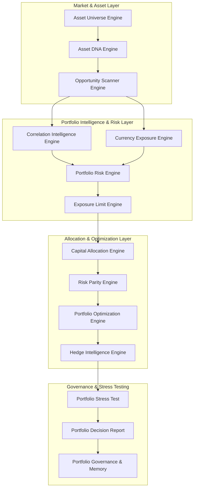
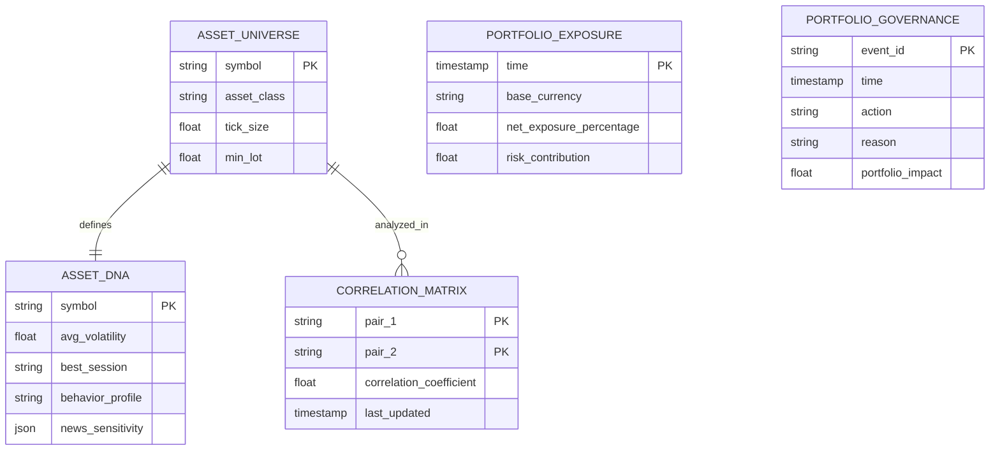

# IATI OS: Institutional Adaptive Trading Intelligence Operating System
## Phase 11: Multi-Asset & Portfolio Intelligence Engine Specification

Dokumen ini merupakan spesifikasi rasmi untuk Fasa 11 (Multi-Asset & Portfolio Intelligence Engine) bagi IATI OS. Fasa ini bertindak sebagai pandangan helikopter (helicopter view) yang mengurus keseluruhan kedudukan aset, pendedahan risiko, korelasi, dan peruntukan modal. Ia menolak konsep bahawa setiap *trade* adalah bebas, sebaliknya melihat setiap *trade* sebagai penyumbang kepada ekosistem dan risiko portfolio keseluruhan.

---

### 1. Portfolio Architecture (Portfolio Intelligence Engine)

Seni bina Portfolio Intelligence Engine direka untuk menyaring dan mengawal kelulusan *trade* berpandukan kesihatan dan pendedahan portfolio semasa.

---

### 2. Asset Universe & Asset DNA Design

*   **Asset Universe Engine:** Pangkalan pendaftaran terpusat untuk semua instrumen merentas pelbagai kelas aset: FOREX (Major, Minor, Exotic), METALS (Gold, Silver), INDICES (NAS100, SP500, DAX), CRYPTO (BTC, ETH), dan COMMODITIES (Oil).
*   **Asset DNA Engine:** Setiap aset mempunyai profil tingkah laku yang unik.
    *   *Contoh Profil EURUSD:* Volatiliti: Sederhana (Medium), Kecairan: Tinggi, Sesi Terbaik: London, Sifat Pasaran: Mesra Trend.
    *   *Contoh Profil XAUUSD (Gold):* Volatiliti: Tinggi, Sangat Sensitif Terhadap Berita, Kekerapan Pencarian Kecairan (Liquidity Sweep): Tinggi.

---

### 3. Correlation Intelligence Model

Sistem secara dinamik memantau dan mengira pekali korelasi (korelasi positif, negatif, dan korelasi tersembunyi) antara aset secara *real-time*.

*   **Mekanisme:** Jika AI mendapati korelasi positif yang melampau antara instrumen yang sedang dipegang (Contoh: Beli EURUSD dan Beli GBPUSD serentak), sistem akan menurunkan peruntukan risiko atau menyekat *trade* kedua.
*   **Objektif:** Memahami *Exposure* sebenar dan mengelakkan penggandaan risiko (risk duplication) yang tidak disedari.

---

### 4. Exposure Calculation Model (Currency Exposure Engine)

Dalam instrumen berpasangan seperti Forex, enjin tidak membaca posisi secara entiti bergabung, tetapi memecahkannya kepada pendedahan aset asas dan sebut harga (base & quote).

*   **Pecahan Pendedahan:**
    *   `BUY EURUSD` = Long EUR, Short USD.
    *   `BUY GBPUSD` = Long GBP, Short USD.
    *   `SELL USDJPY` = Short USD, Long JPY.
*   **Net Exposure Logic:** Dalam contoh di atas, portfolio mengumpul pendedahan **Short USD yang sangat tinggi**. Enjin akan mengeluarkan amaran konsentrasi melampau dan *Exposure Limit Engine* akan menyekat sebarang jualan USD baharu.

---

### 5. Capital Allocation & Risk Parity Framework

Peruntukan modal (Capital Allocation) bukan sekadar bahagi rata (Equal Capital). Ia bergantung kepada sains pengurusan risiko termaju.

*   **Capital Allocation Engine:** Input seperti Keyakinan AI (Confidence), Expected Value, Risiko Pasaran, Korelasi, dan Volatiliti akan menentukan saiz modal. Peluang korelasi rendah dengan *EV* tinggi akan mendapat peruntukan maksimum.
*   **Risk Parity Engine:** Sistem mengagihkan saiz kedudukan berdasarkan *Sumbangan Risiko* (Risk Contribution) yang sama rata.
    *   *Prinsip:* Aset berisiko dan tidak menentu seperti Emas (High Volatility) diberikan peruntukan modal yang lebih kecil. Aset yang stabil (Low Volatility) seperti EURUSD mendapat saiz modal yang lebih besar, memastikan setiap aset memberikan sumbangan risiko 1% yang seimbang kepada keseluruhan portfolio.

---

### 6. Portfolio Risk & Exposure Limit Framework

Sistem meletakkan perlindungan pelbagai tahap ke atas portfolio untuk mengelakkan risiko keruntuhan.

*   **Portfolio Risk Engine:** Mengira Value-at-Risk (VaR) Keseluruhan, Risiko Setiap Aset, Risiko Setiap Mata Wang, dan Risiko Setiap Strategi.
*   **Exposure Limit Engine:** Mempunyai blok maksimum pratetap.
    *   *Maksimum Currency Exposure:* Cth, 5% pada mana-mana satu mata wang.
    *   *Maksimum Sector Exposure:* Cth, 10% maksimum pendedahan pada ekuiti (Indices).
    *   Sistem menyekat *new trade* secara automatik jika had ini ditembusi.

---

### 7. Portfolio Stress Testing Design

Enjin ujian tekanan (Stress Test) secara simulasi berterusan sentiasa menguji portfolio semasa terhadap senario krisis.

*   **Senario Ujian:** Kejutan Kadar Faedah (Interest rate shock), Kejatuhan mengejut (Market panic / Flash crash), Krisis Kecairan.
*   **Matlamat (Soalan Ujian):** Jika berlaku lonjakan mendadak USD (USD Spike 500 pips), berapakah anggaran *Maximum Drawdown*? Adakah portfolio mampu bertahan (survive) tanpa mengalami *Margin Call*? Jika berisiko, *Hedge Intelligence Engine* akan mencadangkan pengurangan posisi.

---

### 8. Database Schema (Portfolio & Assets)

Reka bentuk skema untuk menyimpan konfigurasi pendedahan, DNA instrumen, dan korelasi.

---

### 9. API Design (Portfolio Services)

Endpoints REST API yang digunakan untuk mendapatkan laporan dan mengurus peruntukan pada Portfolio Intelligence Engine.

*   **`GET /api/v1/portfolio/exposure`**
    *   *Fungsi:* Mendapatkan pendedahan bersih semasa mengikut mata wang dan kelas aset.
*   **`GET /api/v1/portfolio/correlation`**
    *   *Fungsi:* Mendapatkan matriks korelasi masa nyata untuk instrumen yang sedang dipegang.
*   **`POST /api/v1/portfolio/allocate`**
    *   *Fungsi:* Menghantar senarai *Trade Decisions* yang lulus kriteria; enjin akan memulangkan saiz posisi berpandukan *Risk Parity*.
*   **`POST /api/v1/portfolio/stress-test`**
    *   *Fungsi:* Memulakan simulasi tekanan (Monte Carlo & historical shock) pada portfolio terbuka semasa.
*   **`GET /api/v1/portfolio/opportunity-ranking`**
    *   *Fungsi:* Scan lebih 100+ instrumen dan kembalikan *Opportunity Score* mengikut urutan teratas.

---

### 10. Implementation Roadmap (Phase 11)

1.  **Tahap 1:** Reka bentuk pangkalan data **Asset Universe & Asset DNA**.
2.  **Tahap 2:** Pembangunan **Currency Exposure Engine** (Net exposure tracker) & **Exposure Limit Engine**.
3.  **Tahap 3:** Pembinaan algoritma pengiraan **Correlation Intelligence Model** (Dynamic correlation calculation).
4.  **Tahap 4:** Pembangunan logik **Risk Parity Engine** & **Capital Allocation Engine** bagi mengurus peruntukan saiz (Position sizing).
5.  **Tahap 5:** Pembinaan **Opportunity Scanner Engine** (Ranker >100 instrumen secara *real-time*).
6.  **Tahap 6:** Integrasi **Portfolio Stress Test** dan sistem penjanaan laporan harian (**Portfolio Decision Report** & *Governance*).
