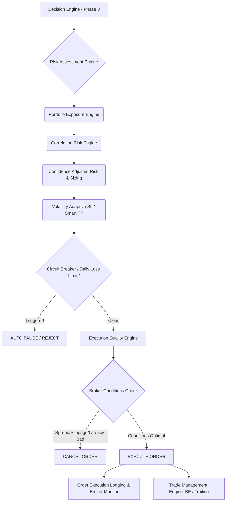
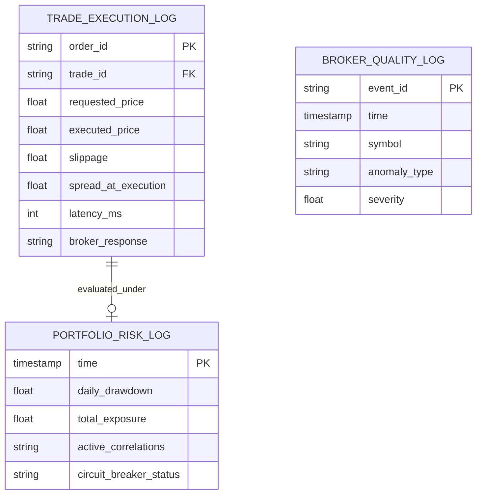

# IATI OS: Institutional Adaptive Trading Intelligence Operating System
## Phase 4: Risk Intelligence & Execution Engine Specification

Dokumen ini merupakan spesifikasi rasmi untuk Fasa 4 (Risk Intelligence & Execution Engine) bagi IATI OS. Matlamat utama modul ini adalah pemeliharaan modal (capital preservation), pengawalan risiko portfolio secara dinamik, perlindungan daripada anomali pasaran, dan pelaksanaan kualiti institusi (institutional-grade execution).

---

### 1. Risk & Execution Architecture

Senibina ini memastikan setiap trade yang melepasi Decision Engine dianalisis pada peringkat portfolio dan broker sebelum pesanan dihantar ke pasaran.



---

### 2. Execution Architecture & Trade Interruption Logic

Pelaksanaan pesanan (Execution) bukan tindakan satu hala. Ia mempunyai pengesahan (reconciliation) dan pemantauan persekitaran (latency, spread).

*   **Execution Quality Check:** Mengukur Spread, jangkaan Slippage, dan Latency ping ke pelayan broker.
*   **Order Reconciliation:** Menyemak semula posisi melalui API jika terputus sambungan (Internet/API Failure) semasa menghantar pesanan.
*   **Broker Quality Monitor:** Merakam setiap anomali lilin (abnormal candle), slip pesanan, penolakan (rejected order), dan spread hantu (spread widening spike).
*   **Fall-back Mechanism:** Jika ping > 300ms, hentikan penghantaran order.

---

### 3. Dynamic Position Sizing Formula & Confidence Adjusted Risk

Peruntukan lot size tidak lagi tetap. Ia dikira berdasarkan Formula Risiko Dinamik.

**Parameter Asas:**
*   $E$ = Akaun Ekuiti
*   $R_{base}$ = Risiko asas (%) - cth. 1%
*   $C_{adj}$ = Confidence Adjustment (Berdasarkan Market Confidence Score)
*   $D_{adj}$ = Drawdown Adjustment
*   $SL_{dist}$ = Jarak Stop Loss (dalam pip)
*   $V$ = Nilai setiap pip (Pip Value)

**Langkah 1: Pengubahsuaian Risiko Berdasarkan Keyakinan (Confidence Adjusted Risk)**
*   Keyakinan 90% - 100% ➜ $R_{target} = R_{base} \times 1.0$
*   Keyakinan 80% - 89% ➜ $R_{target} = R_{base} \times 0.75$
*   Keyakinan 75% - 79% ➜ $R_{target} = R_{base} \times 0.5$
*   Keyakinan < 75% ➜ **NO TRADE**

**Langkah 2: Pengubahsuaian Drawdown (Drawdown Control Engine)**
*   Akaun di Paras Tertinggi (ATH) ➜ Tiada penalti.
*   Akaun -5% Drawdown ➜ $D_{adj} = 0.5$ (Risiko dipotong separuh).
*   Akaun -10% Drawdown ➜ $D_{adj} = 0.25$ (Risiko suku).
*   Akaun -15% Drawdown ➜ **CIRCUIT BREAKER: AUTO PAUSE**

**Langkah 3: Pengiraan Saiz Posisi Definitif**
`Lot Size = ( E × (R_target × D_adj) ) / ( SL_dist × V )`

---

### 4. Volatility Adaptive SL, Smart TP & Management

Struktur keluar (Exit Structure) disesuaikan dengan rejim pasaran dan zon kecairan.

*   **Volatility Adaptive Stop Loss:** Tidak menggunakan SL = 30 pip. 
    *   Jika Volatiliti Tinggi (ATR mengembang): `SL = Jarak Invalidation + (1.5 × ATR(14))`
    *   Jika Volatiliti Rendah: `SL = Jarak Invalidation + (0.5 × ATR(14))`
*   **Smart Take Profit:** Diletakkan berdasarkan unjuran ATR, Struktur seterusnya (Resistance/Support), dan Kumpulan Kecairan (Liquidity Pool). Bukannya nisbah purata (fixed RR).
*   **Break Even Engine:** Memindahkan SL ke BE (Break Even) *hanya jika* struktur mikro menyokong pergerakan dan momentum mengekalkan kekuatannya. Jika harga sekadar membuat "whipsaw" dengan volatiliti tinggi, BE dilewatkan.
*   **Trailing Management Engine:** Trailing menggunakan HHL (Higher Higher Lows) atau ATR multiplier (cth: Chandelier Exit) bersesuaian dengan rejim Trend Berterusan (Trending Regime).

---

### 5. Portfolio Risk Model & Correlation Engine

Risiko dikira pada peringkat agregat (portfolio), bukan peringkat satu trade.

*   **Exposure Currency Check:** Menjumlahkan pendedahan mengikut mata wang. 
    *   *Contoh:* Long EUR/USD (+1 USD Short), Long GBP/USD (+1 USD Short), Short USD/JPY (+1 USD Short).
    *   *Output:* USD Exposure melampaui had. Enjin menolak (Reject) pesanan ketiga.
*   **Correlation Penalty:** Jika mengesan dua trade berkorelasi tinggi (pekali korelasi > +0.8), salah satu saiz posisi akan dikurangkan 50% atau pesanan yang mempunyai keyakinan (Confidence) lebih rendah ditolak.

---

### 6. Circuit Breaker Logic

Sistem ini mematikan operasi berdagang (Trading Halt) apabila syarat-syarat berbahaya dipenuhi:

1.  **Macro & Daily Loss:** Kerugian Harian mencecah -3%, atau Kerugian Mingguan mencecah -6%.
2.  **Market Anomaly:** Volatiliti meningkat secara tidak normal (Spike > 300% daripada ATR harian) atau kejatuhan harga mengejut (Flash Crash).
3.  **Broker Issues:** Spread melebihi had (cth. EUR/USD spread naik dari 0.5 ke 10.0 pip tiba-tiba) atau berlakunya Slippage berulang kali (kegagalan penyelesaian kualiti melebihi 3 kali berturut-turut).
4.  **Consecutive Losses:** Kekalahan beruntun (Consecutive losses) > 5 kali akibat perubahan rejim mendadak.

---

### 7. Risk Explanation Report

Bagi mematuhi XAI (Explainable AI), setiap pesanan disertakan dengan laporan pengurusan risiko:

```text
==================================================
RISK & EXECUTION REPORT: EURUSD (BUY)
==================================================
Trade Risk        : MEDIUM (0.75% Exposure)
Reasoning         : Confidence 82%, Drawdown 0%, Normal Volatility.
Sizing Logic      : Equity $100,000 -> Risk $750. 
                    SL = 25 pips (Structure + 0.5 ATR). 
                    Position Size = 3.0 Lots.
Portfolio Impact  : USD Short Exposure (Acceptable: 1/3 limit).
Execution Quality : Spread: 0.6 pips, Latency: 45ms.
Status            : APPROVED FOR EXECUTION
==================================================
```

---

### 8. Database Schema (Risk & Execution Storage)

Pangkalan data (Database) merakam peristiwa risiko dan pelaksanaan untuk tujuan Pengauditan (Audit) dan Pembelajaran Adaptif (Adaptive Learning).



---

### 9. Stress Testing Strategy

Sistem akan diuji dalam keadaan paling ekstrem sebelum "Go-Live":

1.  **Market Crash Simulation:** Menggunakan data sejarah 2008 atau COVID-19 2020 untuk memastikan SL dan Circuit Breaker berfungsi ketika krisis kecairan.
2.  **Spread Explosion Test:** Sengaja memasukkan spread simulasi palsu (50 pips) untuk mengesahkan enjin *Execution Quality* menolak entri.
3.  **Drawdown Decay Simulation:** Menghasilkan urutan 20 kekalahan berturut-turut untuk menguji algoritma *Drawdown Control Engine* menurunkan saiz lot dengan berkesan bagi memanjangkan hayat modal.

---

### 10. Implementation Roadmap (Phase 4 to Production)

1.  **Tahap 1:** Pembinaan Sistem Penetapan Saiz Posisi Dinamik dan Model Pengubahsuaian Drawdown.
2.  **Tahap 2:** Pengaturcaraan Algoritma Volatiliti SL (ATR) dan Kriteria Break Even / Trailing.
3.  **Tahap 3:** Pembangunan Pemantau Korelasi Portfolio & Had Pendedahan.
4.  **Tahap 4:** Penciptaan Logik *Circuit Breaker* dan Enjin Kualiti Pelaksanaan (Spread/Slippage check).
5.  **Tahap 5:** Integrasi API Broker dengan Mekanisme Pengendalian Ralat (Disconnect Recovery) dan Log Audit.
6.  **Tahap 6 (Production Readiness):** Pelaksanaan Ujian Tekanan Ekstrem (Stress Test) secara serentak (End-to-End Test dari Phase 1 hingga Phase 4).
