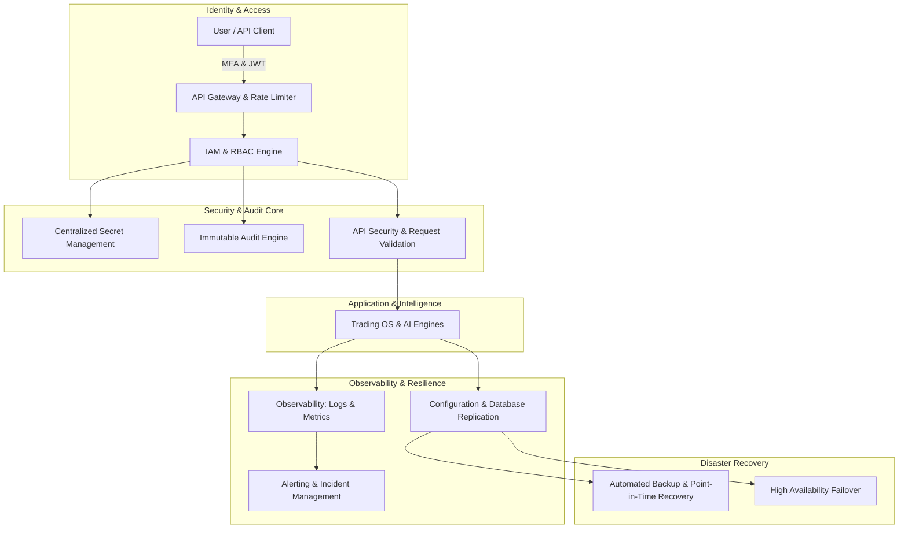

# IATI OS: Institutional Adaptive Trading Intelligence Operating System
## Phase 28: Enterprise Security, Compliance & Disaster Recovery Engine

Dokumen ini merupakan spesifikasi rasmi untuk Fasa 28 (Enterprise Security, Compliance & Disaster Recovery Engine) bagi IATI OS. Fasa ini direka untuk membina ekosistem keselamatan bertaraf institusi dan pelan pemulihan bencana yang komprehensif bagi memastikan sistem terus kebal terhadap serangan siber, kegagalan infrastruktur, dan kesilapan manusia.

**Prinsip Teras (Core Principle):** *Anggaplah setiap sistem pasti akan gagal, setiap akaun pasti akan diserang, dan setiap pelancaran perisian pasti mempunyai pepijat (bugs).* Sistem mestilah mampu bertahan dengan selamat.

---

### 1. Security Architecture (Enterprise Security Platform)

Seni bina keselamatan IATI OS dibina berdasarkan prinsip *Defense-in-Depth* (Pertahanan Mendalam) dan *Zero Trust*.

---

### 2. Identity & Access Design (IAM & RBAC)

Hanya pengguna atau entiti yang disahkan dan diizinkan sahaja boleh mengakses IATI OS. Prinsip Keistimewaan Minimum (*Principle of Least Privilege*) diamalkan.

*   **Authentication (Pengesahan):** Menyokong integrasi *OAuth2*, *JWT*, dan *Multi-Factor Authentication (MFA)* wajib. Termasuk pengurusan sesi, penjejakan peranti, dan tamat tempoh sesi (Session Expiration) secara automatik.
*   **Role-Based Access Control (RBAC):**
    *   `System Administrator`: Akses penuh konfigurasi sistem dan keselamatan.
    *   `Quant Researcher`: Akses kepada *Model Registry* dan Penyelidikan sahaja (tiada akses kewangan).
    *   `Risk Manager`: Kuasa untuk meluluskan, membatalkan, atau menukar parameter risiko dan *override*.
    *   `Portfolio Manager`: Akses untuk memantau pendedahan aset (Exposure) dan meluluskan mod dagangan.
    *   `Developer`: Akses log dan pengedaran sistem sahaja.
    *   `Auditor` / `Read Only User`: Akses baca sahaja kepada *Audit Engine* dan papan pemuka operasi.
    *   `API Client`: Akses mesin-ke-mesin melalui Token yang ditandatangani secara kriptografi.

---

### 3. Disaster Recovery Plan & Business Continuity

Kesinambungan perniagaan memfokuskan kepada kelangsungan operasi walaupun berlaku gangguan sistemik.

*   **Recovery Objectives:**
    *   *Recovery Time Objective (RTO):* Masa maksimum disasarkan untuk mengembalikan operasi penuh (Contoh: < 5 minit untuk *Failover* automatik).
    *   *Recovery Point Objective (RPO):* Had maksimum kehilangan data yang boleh diterima (Contoh: < 1 minit untuk kerosakan pangkalan data utama).
*   **Business Continuity Procedures:** Dokumen Prosedur Standard (SOP) jika berlaku:
    1.  *Broker Failure:* AI terus menangguhkan pesanan (*Pause*) dan beralih ke saluran *Backup Broker*.
    2.  *Market Data Failure:* Pembatalan semua *pending orders*, posisi bertukar ke mod pengurusan risiko pasif.
    3.  *Cloud / DB Failure:* Mengaktifkan pelayan bersedia (Standby Server) secara drastik (Failover).
    4.  *LLM Service Failure:* Menggantikan LLM pemikiran kepada *Fall-back ML Statistical model*.

---

### 4. Backup Strategy (Data & Model Resilience)

Strategi sandaran memastikan pemulihan (recoverability) mutlak.

*   **Automated Backup:** Penjadualan sandaran automatik bagi pangkalan data, fail model ML (Model Recovery), dan profil konfigurasi.
*   **Point-in-Time Recovery (PITR):** Membenarkan pengembalian pangkalan data pasaran kepada satu minit yang spesifik sebelum kerosakan berlaku.
*   **Encrypted Storage:** Semua data sandaran (Kredential, Akaun Dagangan, Konfigurasi sensitif, Log Audit) disulitkan dengan piawaian penyulitan tinggi (AES-256). Kunci broker / API LLM tidak disimpan dalam kod (source code) tetapi dalam peti kebal rahsia berpusat (*Centralized Secret Management*) yang mempunyai penggiliran kekunci (Secret Rotation).

---

### 5. High Availability Design

Seni bina platform memastikan kelangsungan ketersediaan tinggi tanpa *Single Point of Failure (SPOF)*.

*   **Service Redundancy & Failover:** Pangkalan data dan perkhidmatan mikro sentiasa dijalankan dengan model Replikasi (Master-Slave atau Multi-Master). Sekiranya perkhidmatan nod gagal, mekanisme *Automatic Failover* mengalihkan trafik seketika.
*   **Load Balancing & Health Checks:** Agihan beban trafik pintar. *Health Checks* dikawal oleh agen memantau komponen memori, prestasi API, dan latensi sistem, lalu mengeluarkan notis jika wujud anomali.
*   **Graceful Shutdown:** Menguruskan penutupan proses sistem dengan selamat (menutup semua transaksi dagangan terbuka sebelum mematikan mesin).

---

### 6. Audit Framework & Compliance

Rangka kerja audit melindungi integriti tindakan sepanjang kitaran operasi.

*   **Immutable Audit Logs:** Setiap data pengauditan adalah *Tamper-proof* (kekal dan tidak boleh diubahsuai walau oleh *System Administrator*).
*   **Events Tracked:** *Login/Logout, Configuration Changes, Trade Requests, Risk Overrides, Model Deployment, Strategy Changes, Permission Changes.*
*   **Compliance Traceability:** Jejak langkah penuh ke atas semua data (Data Retention Policy), kod, kelakuan ejen, dan akses manusia ke atas sistem. Keputusan AI, peramalan model, dan tindakan pengurusan konfigurasi mesti boleh dipulihkan rentas masa.

---

### 7. API Specification (Security & Recovery)

Piawaian titik akhir API meliputi Pengesahan, Keselamatan, Penjejakan dan Pemulihan. Semua laluan memerlukan token yang sah (kecuali log masuk). Titik akhir dilindungi oleh *Rate Limiting* dan penapisan input (Input Validation & Output Sanitization).

*   **`POST /api/v1/auth/login`** : Autentikasi dan pengeluaran JWT.
*   **`POST /api/v1/auth/logout`** : Menamatkan sesi pengguna/peranti.
*   **`POST /api/v1/auth/refresh`** : Memperbaharui token capaian (Access Token).
*   **`GET /api/v1/audit/logs`** : Mengambil keseluruhan log transaksi berdaftar.
*   **`GET /api/v1/security/events`** : Akses untuk siasatan acara pemecahan protokol.
*   **`GET /api/v1/system/health`** : Pemantauan sistem pelayan dan metrik prestasi.
*   **`POST /api/v1/backup/create`** : Pembuatan imej sandaran pangkalan data serta persekitaran (Snapshot).
*   **`POST /api/v1/recovery/restore`** : Pemulihan sistem kepada tarikh (*Point-in-Time*) yang ditetapkan.

---

### 8. Operations Dashboard Design (Security Center)

Pusat Perintah (Command Center) yang memberikan gambaran keseluruhan pemantauan sistem (Observability).

1.  **System Health & Metrics:** Graf RAM, CPU, Pemantauan Pangkalan Data dan Prestasi Infrastruktur.
2.  **Security Events Panel:** Log untuk Percubaan Log Masuk Gagal, Pengaksesan Tanpa Kebenaran, atau Isyarat Serangan (Alert Center).
3.  **Audit Trail View:** Jadual tatalan (Scrollable table) untuk memantau penukaran profil dan mod pasaran.
4.  **Replication & Backup Status:** Indikator RTO/RPO dengan status sandaran (Contoh: "Last Backup: 5 mins ago").
5.  **Incident Management:** Status peleraian masalah (*Severity, Root Cause, Remediation*).

---

### 9. Security Testing Plan

Bagi memastikan kebalan aplikasi, pengujian yang ketat (Pen-testing) mesti dilakukan ke atas kerangka infrastruktur.

1.  **Authentication & Authorization Test:** Mencuba log masuk berbilang yang gagal, menilai had masa JWT, serta penstriman hak istimewa (privilege escalation).
2.  **Secret Management Test:** Memastikan penembusan pada *source code* tidak melepaskan maklumat API Broker.
3.  **Recovery & Failover Test:** Memutuskan sambungan pangkalan data secara sengaja di bawah persekitaran *Staging* untuk menganalisis tindak balas pemulihan.
4.  **Audit Integrity Test:** Cuba memadam jadual log pengauditan menggunakan profil yang berlainan.
5.  **Alerting Test:** Mencetuskan insiden palsu untuk mengesahkan penyampaian amaran e-mel / SMS beroperasi.

---

### 10. Production Readiness Checklist

Sebelum memulakan penggunaan sebenar (Production), sistem wajib lulus semakan ini:

*   [ ] **Secure:** Rahsia, kredensial dan kata laluan terkumpul di Pengurus Rahsia (*Secret Manager*) berpusat.
*   [ ] **Auditable:** Semua tindakan dicetak menjadi jejak kekal tanpa celah pada `audit_logs`.
*   [ ] **Recoverable:** Matlamat Pemulihan Masa/Mata (RTO & RPO) telah diuji secara praktikal dan mencapai standard institusi.
*   [ ] **Highly Available:** Pelayan berganda sedia melayan beban agihan dengan automatik (*Auto-scaling* dan *Failover*).
*   [ ] **Fault Tolerant:** Platform terus berjalan dalam keadaan terkawal (Mod Perlindungan Terbatas) jika komponen kecil gagal.
*   [ ] **Scalable:** Senibina pangkalan data memuatkan saiz jejak (audit history & system metrics) untuk 5+ tahun secara skala mendatar (Horizontal scaling).
*   [ ] **Institutional Grade Compliance:** Pengawalseliaan data dikonfigurasikan mengikut Dasar Pengekalan (Data Retention Policy).

**STATUS KESELURUHAN:** *Disaster Recovery & Enterprise Security Pipeline* kini bersedia untuk pelaksanaan pengaturcaraan (Coding Implementation).
