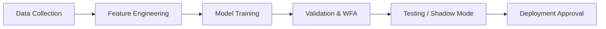

# IATI OS: Institutional Adaptive Trading Intelligence Operating System
## Phase 8: Trading Validation, Research & AI Training Framework

Dokumen ini merupakan spesifikasi rasmi untuk Fasa 8 (Trading Validation, Research & AI Training Framework) bagi IATI OS. Matlamat fasa ini adalah untuk membina persekitaran penyelidikan bertaraf institusi yang memastikan semua strategi dan model AI disahkan (validated) secara statistik, tidak dipengaruhi bias, dan diuji tekan (stress-tested) sebelum diluluskan ke persekitaran produksi.

---

### 1. Research Architecture (Quant Research Lab)

Seni bina penyelidikan bertindak sebagai persekitaran terpencil (sandbox) di mana saintis data dan jurutera kuantitatif boleh bereksperimen tanpa mengganggu produksi.

*   **Fungsi Utama:** Eksperimen strategi, Analisis data, Pengujian ciri (Feature testing), Pembandingan model.
*   **Sistem Log Eksperimen:** Setiap eksperimen diwajibkan mempunyai rekod yang merangkumi: `Experiment ID`, `Hypothesis`, `Data Used (Timeframe & Symbol)`, `Methodology`, `Result (Metrics)`, dan `Conclusion`.

---

### 2. Realistic Backtesting Framework

Enjin Backtest IATI OS tidak hanya mengira harga Mula/Tutup, tetapi mensimulasikan realiti pasaran untuk menghalang ilusi "Backtest Profit".

*   **Simulasi Keadaan Sebenar:**
    *   **Tick-Level Granularity:** Menggunakan data tick untuk simulasi tepat.
    *   **Spread Expansion:** Mengambil kira pelebaran spread sewaktu pertukaran sesi dan siaran berita.
    *   **Liquidity & Slippage:** Mengenakan gelinciran (slippage) buatan dan mensimulasikan penolakan pesanan (order rejection) jika volum terlalu besar.
    *   **Execution Delay:** Memasukkan kependaman pelaksanaan rawak (contoh: 50ms - 300ms) untuk menguji kepekaan sistem terhadap perubahan harga pantas.

---

### 3. Validation Framework & Stress Testing

Untuk membezakan tuah dan kemahiran (skill), strategi wajib melalui lapisan pengesahan (validation) yang ketat.

*   **Walk Forward Analysis (WFA):** Menghalang *Curve Fitting* dengan memisahkan tingkap data.
    *   *Contoh:* Latih pada data 2018-2022 ➜ Sahkan parameter pada 2023 ➜ Uji secara membuta tuli (Blind test) pada 2024.
*   **Monte Carlo Stress Test:** Mensimulasikan ribuan senario dengan menyusun rawak urutan trade (randomized trade sequence) untuk mencari keadaan terburuk (Worst Case Drawdown).
    *   *Soalan Utama:* Adakah akaun akan musnah jika sistem berdepan 20 kekalahan rawak berturut-turut? Jika Ya ➜ **REJECT**.

---

### 4. AI Training Pipeline

Saluran latihan AI standard dan konsisten untuk memastikan tiada kecacatan struktur dalam penjanaan model.

*   **Feature Engineering:** Model tidak mengambil harga mentah, sebaliknya menggunakan penunjuk konseptual: Trend, Volatiliti, Kumpulan Kecairan, Momentum, Sesi, Status Rejim Pasaran, dan Tingkah Laku Lampau (Previous Outcome).

---

### 5. Overfitting & Data Leakage Protection

Sistem perlindungan proaktif terhadap manipulasi data sama ada sengaja atau tidak sengaja.

*   **Overfitting Detection Engine:** Mencetuskan amaran "Strategy mungkin curve fitted" jika ia mengesan:
    *   Parameter pengoptimuman yang terlalu banyak (Terlalu banyak syarat *IF*).
    *   Prestasi terlalu sempurna (Contoh: Win rate 98% dengan beratus trade).
    *   Kebergantungan kepada satu pergerakan sejarah tertentu sahaja (Historical dependency).
*   **Data Leakage Detection:** Memastikan AI hanya boleh mengakses data sehingga ke nilai *timestamp* semasa. Menyekat penggunaan data tertangguh atau melihat ke masa hadapan (Look Ahead Bias).

---

### 6. Deployment Approval Process (Go Live)

Strategi tidak boleh dimasukkan ke pelayan produksi secara automatik.

*   **Shadow Production Testing:** Sebelum berdagang dengan wang sebenar, sistem berjalan di belakang tabir. AI menjana keputusan dan ramalan, tetapi sistem TIDAK menembak pesanan ke broker. Prestasi diukur antara *Prediction vs Real Market Outcome*.
*   **Go-Live Requirements (Gatekeeper):**
    1.  Minimum sampel trade dicapai (Cth: 500 trades).
    2.  Jangkaan Nilai (Expectancy) positif.
    3.  Drawdown Maksimum (MDD) berada dalam had yang dibenarkan.
    4.  Lulus ujian Monte Carlo (Peluang kerugian kritikal < 1%).
    5.  Lulus audit pematuhan Risiko (Risk).

---

### 7. Performance Measurement & Strategy Scorecard

Pengukuran tidak sekadar menggunakan metrik ketepatan klasifikasi biasa, tetapi menggunakan metrik kuantitatif pengurusan dana.

*   **Model Performance Evaluation:** Profit Factor, Expectancy, Sharpe Ratio, Sortino Ratio, Maximum Drawdown (MDD).
*   **Model Comparison Engine:** Sistem membandingkan Model A (Cth: Rule-based) dengan Model B (Cth: Machine Learning) berdasarkan prestasi luar sampel (Out-of-sample).
*   **Strategy Scorecard:** Skala (Score) holistik untuk strategi (Maksimum 100%):
    *   Profitability (30%) + Risk (25%) + Consistency (20%) + Robustness (15%) + Adaptability (10%).

---

### 8. Research Workflow & Continuous Intelligence

AI Research Engine bukan sekadar berjalan sekali, tetapi merupakan satu kitaran hidup berterusan.

*   **Continuous Research Engine:** AI bertugas di belakang tabir setiap minggu untuk mengesan degradasi prestasi, corak baru pasaran, atau perubahan makroekonomi (Market Regime shift).
*   **AI Research Report:** Laporan Mingguan dijana secara automatik yang mengandungi ringkasan perubahan pasaran, prestasi strategi, amaran penyelewengan risiko, dan cadangan (tanpa pelaksanaan auto).

---

### 9. Final Production Checklist

Protokol terakhir sebelum sebarang model, enjin atau strategi dibenarkan mengurus modal.

*   [ ] **System:** Stabil, Terselamat (Secure), dan dipantau penuh (Monitored).
*   [ ] **Strategy:** Telah melalui Backtest Realistik, diuji WFA, dan tahan ujian Monte Carlo (Robust).
*   [ ] **AI:** Telah dikalibrasi (Calibrated), berupaya menerangkan keputusannya (Explainable), dan tiada kebocoran data (Audited).
*   [ ] **Risk:** Pengurusan lot dinamik (Controlled), Circuit Breaker aktif (Protected).

---

### 10. Implementation Roadmap (Phase 8)

1.  **Tahap 1:** Pembangunan **Quant Research Lab** & *Backtest Engine* (Realistik dengan slippage/spread).
2.  **Tahap 2:** Pengaturcaraan **Walk Forward Analysis (WFA)** dan **Monte Carlo Simulator**.
3.  **Tahap 3:** Pembinaan **Overfitting & Data Leakage Detector** dalam rangka kerja pengujian.
4.  **Tahap 4:** Pembangunan **AI Training Pipeline** & infrastruktur Pengekstrakan Ciri (Feature Engineering).
5.  **Tahap 5:** Sistem Pemarkahan Strategi (Scorecard) dan Metrik Penilaian Kuantitatif (Sharpe, Profit Factor).
6.  **Tahap 6:** Penyediaan **Shadow Trading Mode** dan Pembinaan Papan Laporan Penyelidikan Mingguan (Research Workflow).
