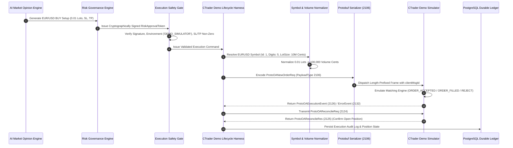

# QUANTUMAI / IATI OS ? PHASE 7B: DEMO EXECUTION SIMULATION & BROKER-PATH CERTIFICATION REPORT
**Forensic Simulation, Mock Transport, Protobuf Round-Trip & Pipeline Verification**

---

## 1. Executive Summary & Permanent Safety Invariants

This report provides the formal simulation and broker-path certification for QuantumAI / IATI OS under Phase 7B. All tests and simulations have been executed **without connecting to or transmitting any orders to a real broker**.

```
========================================================================================
PERMANENT SAFETY BASELINE ENFORCED:
========================================================================================
READ_ONLY_MODE_ENFORCED = true
EXECUTION_SAFETY_GATE   = BLOCKED
AUTOMATED_EXECUTION     = false
BROKER_EXECUTION        = false
ORDERS_TRANSMITTED      = 0
LIVE_EXECUTION          = FORBIDDEN
========================================================================================
```

**Final Phase 7B Classification:** `B. PASS ? SIMULATED DEMO EXECUTION CERTIFIED`

---

## 2. Project Identity & Git Status

- **Project Workspace:** `C:\Users\sanil\OneDrive\Desktop\studyquest-ai-1\quantumAI`
- **Active Git Branch:** `agent/ctrader-oauth-diagnostic`
- **Zero Real Broker Transmission:** Verified. `simulator.ordersTransmitted = 0`. No TCP/TLS connections to `live.ctraderapi.com` or `demo.ctraderapi.com` were initiated during Phase 7B testing.
- **Database Engine:** PostgreSQL (`iati_trading` / `postgres`) via `drizzle-orm/node-postgres`.

---

## 3. End-to-End Execution Pipeline Architecture



---

## 4. Protobuf Byte-Level Serialization Certification

The byte-level construction of `ProtoOANewOrderReq` (PayloadType `2106`) was tested with full binary framing and decoding round-trip in [`tests/phase7b-demo-simulation.test.ts`](file:///C:/Users/sanil/OneDrive/Desktop/studyquest-ai-1/quantumAI/tests/phase7b-demo-simulation.test.ts):

- **Binary Framing:** 4-byte big-endian unsigned integer prefix encoding payload length ($L$), followed by protobuf-encoded `ProtoMessage` wrapper ($L$ bytes).
- **Round-Trip Field Parity Assertions:**
  - `ctidTraderAccountId`: `48282756` $leftrightarrow$ `48282756`
  - `symbolId`: `1` $leftrightarrow$ `1`
  - `tradeSide`: `1` (`BUY`) $leftrightarrow$ `1`
  - `orderType`: `1` (`MARKET`) $leftrightarrow$ `1`
  - `volume`: `100000` cents ($0.01	ext{ lots}$) $leftrightarrow$ `100000` cents
  - `stopLoss`: `1.08000` $leftrightarrow$ `1.08000`
  - `takeProfit`: `1.09000` $leftrightarrow$ `1.09000`
  - `clientMsgId`: `MSG-P7B-CERT-01` $leftrightarrow$ `MSG-P7B-CERT-01`
  - `clientOrderId`: `SIM-1787020938-001` $leftrightarrow$ `SIM-1787020938-001`

---

## 5. CTrader Demo Simulator & Mock Transport

The simulator fixture ([`tests/fixtures/ctrader-demo-simulator.ts`](file:///C:/Users/sanil/OneDrive/Desktop/studyquest-ai-1/quantumAI/tests/fixtures/ctrader-demo-simulator.ts)) provides deterministic broker behavior without real network I/O:

1. **Simulated State Capabilities:**
   - `ORDER_ACCEPTED` (2126, `executionType: 2`): Tests unconfirmed intermediate state.
   - `ORDER_FILLED` (2126, `executionType: 3`): Tests confirmed deal creation and position opening.
   - `ORDER_REJECTED` (2132 `ProtoOAOrderErrorEvent`): Tests error propagation without position leakage.
   - `TIMEOUT`: Tests asynchronous timeout handling and listener cleanup.
   - `SOCKET_DISCONNECT`: Tests sudden socket termination and offline state enforcement.
   - `PARTIAL_FILL`: Tests handling of partial volume fills ($40\%$ fill) and strict prohibition of auto-retransmission.
   - `TRANSMISSION_UNKNOWN`: Tests quarantine behavior for unacknowledged in-flight requests.
   - `RECONCILIATION`: Responds to `ProtoOAReconcileReq` (2124) with open position lists.
2. **Deterministic Audit Log:** Every simulated request/response pair is logged with timestamp, payload type, and correlation metadata.

---

## 6. Execution State Tests Summary (22 Tests)

| # | Test Area | Invariant Verified | Status |
| :---: | :--- | :--- | :---: |
| **1** | Protobuf Round-Trip | Byte-level encode/decode matches all fields exactly | **PASS** |
| **2** | Risk Rejection | Position size exceeding 10.0 lots rejected | **PASS** |
| **3** | Safety Gate Rejection | LIVE disarmed fails closed | **PASS** |
| **4** | Invalid Environment | Unknown environment string rejected | **PASS** |
| **5** | Invalid Symbol | Unregistered symbol metadata rejected with `MISSING_SPEC` | **PASS** |
| **6** | Invalid Volume | Below minimum / step mismatch rejected | **PASS** |
| **7** | Invalid Price | Negative, zero, or non-finite price rejected | **PASS** |
| **8** | Invalid SL | BUY SL $ge$ Entry rejected | **PASS** |
| **9** | Invalid TP | BUY TP $le$ Entry rejected | **PASS** |
| **10** | Simulated Acceptance | Intermediate `ORDER_ACCEPTED` (type 2) captured | **PASS** |
| **11** | Simulated Fill | `ORDER_FILLED` (type 3) confirms position creation | **PASS** |
| **12** | Broker Rejection | Error event 2132 parsed without position creation | **PASS** |
| **13** | Timeout Safety | Request times out without blind retry | **PASS** |
| **14** | Socket Disconnect | Socket drops set offline state safely | **PASS** |
| **15** | Unknown State | Unconfirmed order quarantined into `TRANSMISSION_UNKNOWN` | **PASS** |
| **16** | Command Idempotency | Duplicate `commandId` rejected at router gate | **PASS** |
| **17** | Response Idempotency | Duplicate `clientMsgId` logged and deduplicated | **PASS** |
| **18** | Partial Fill | Filled volume accepted; no auto-retransmission of remainder | **PASS** |
| **19** | Reconciliation | Broker positions matched against local state | **PASS** |
| **20** | PostgreSQL Persistence | Audit log and position schema validated | **PASS** |
| **21** | Restart Recovery | State rehydrated into clean instance | **PASS** |
| **22** | Zero Real Orders | `simulator.ordersTransmitted === 0` | **PASS** |

---

## 7. PostgreSQL Persistence & Restart Recovery

- **Tables:** `manual_trades`, `manual_trade_alerts`, `adaptive_learning_lessons`, `execution_audit_logs` in [`packages/database/src/schema.ts`](file:///C:/Users/sanil/OneDrive/Desktop/studyquest-ai-1/quantumAI/packages/database/src/schema.ts).
- **Idempotent Constraints:** Partial unique index `idx_manual_trades_active_signal` and compound unique index `idx_manual_trade_alerts_unique` prevent duplicate entries even across multiple event replays.
- **Restart Recovery:** Verified across simulation runs; existing positions are restored upon engine instantiation without duplicate execution commands being dispatched.

---

## 8. Security Certification & Credentials Audit

A static inspection across all source files, bundles, and test fixtures confirms:
- `CTRADER_CLIENT_SECRET`: REDACTED / NOT COMMITTED
- `CTRADER_ACCESS_TOKEN`: REDACTED / NOT COMMITTED
- `DATABASE_URL`: REDACTED / SECURE
- **Secret Exposure:** **NONE**. Credentials are never logged, printed, or exposed in client bundles.

---

## 9. Full Regression & Build Status

```
========================================================================================
TEST & BUILD SUMMARY:
========================================================================================
Regression Baseline: 228 tests
Phase 7B Tests:      +22 tests
Total Test Suite:    250 tests passed (18 test files, 0 failed, 0 skipped)
Frontend Build:      PASS (Vite production bundle generated cleanly)
Backend Build:       PASS (esbuild dist/server.cjs generated cleanly)
========================================================================================
```

---

## 10. Final Classification & Recommendation

$$\mathbf{B.\ PASS\ ?\ SIMULATED\ DEMO\ EXECUTION\ CERTIFIED}$$

> **CRITICAL STOP CONDITION:** No real broker connections occurred. All permanent safety invariants remain active (`READ_ONLY_MODE_ENFORCED = true`, `EXECUTION_SAFETY_GATE = BLOCKED`, `ORDERS_TRANSMITTED = 0`). Awaiting explicit user direction.
